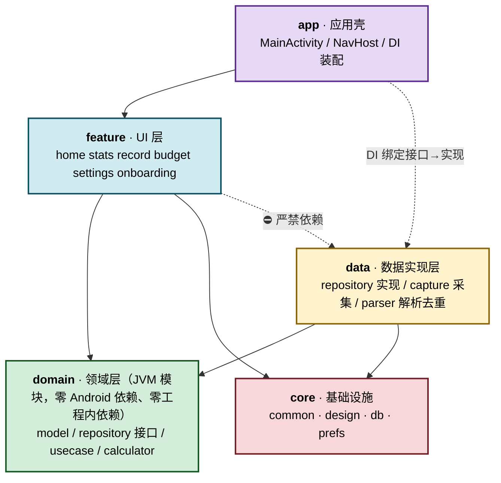
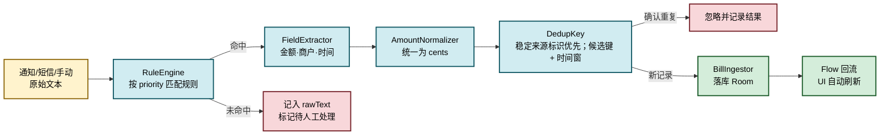

# 小凯记账 · 框架设计文档

| 项目 | 内容 |
|---|---|
| 文档名称 | 设计文档_框架设计_v1.0.0.md |
| 版本 | v1.1.18 |
| 创建日期 | 2026-09-12 |
| 项目 | 小凯记账（BillOfKai） |
| 包名 / namespace | `com.kai.bill`（源码包名与 Gradle namespace） |
| 应用标识 | `com.kai.billofkai`（applicationId，与包名解耦，改包名不影响已装应用） |
| 平台 | 原生 Android（Kotlin + Jetpack Compose） |
| 适用形态 | 自用 / 私下分发 APK（不上架应用商店） |

### 变更记录

| 版本 | 日期 | 修订人 | 说明 |
|---|---|---|---|
| v1.0.0 | 2026-09-12 | — | 首版：确立分层架构、模块划分、职责边界、目录结构、核心机制与编码规范 |
| v1.1.0 | 2026-09-12 | — | 缩短路径：模块 `designsystem→design`、`database→db`、`datastore→prefs`；包名 `com.kai.billofkai→com.kai.bill`（applicationId 保持不变）；补充 domain 为 JVM 模块故源码目录为 `src/main/kotlin` |
| v1.1.1 | 2026-09-12 | — | 修正依赖矩阵：`domain` 实为**零依赖**（不依赖 `core:common`，否则 JVM 模块无法依赖 Android Library）；`feature` 新增 `core:prefs` 依赖（外观设置页需读写 ThemeConfig）。两处均已在 §4.1 记录设计理由 |
| v1.1.2 | 2026-09-12 | — | 修正采集可靠性、来源稳定标识、弱去重键、交易时间语义；补充原文隐私、Room 迁移、采集状态和平台兼容约定 |
| v1.1.3 | 2026-09-12 | — | 根据首页截图统一视觉风格：卡片分组为主、液态玻璃为补充，细化主卡/分组卡/按钮/列表/底部导航规范 |
| v1.1.4 | 2026-09-12 | — | 修正 §5 文件树：usecase 重复/错层、KaiBottomBar 双重归属、Clock 归属与 domain 零依赖对齐、底栏 3 Tab、data Manifest、Mapper/命名对称、Tab 根 vs 二级路由标注 |
| v1.1.5 | 2026-09-12 | — | 移除 CSV 账单导入与备份导出：删除 `SourceType.IMPORT`、`feature/importbill`、`data/capture/file`、`data/backup`、`usecase/backup`；采集源收敛为通知 + 短信 + 手动 |
| v1.1.6 | 2026-09-12 | — | 卡片去玻璃：`GlassCard`/`GroupCard`/`ListCard` 改为纯色 surface 分组；保留 `LiquidBackground` 与 `GlassBottomBar` |
| v1.1.7 | 2026-09-12 | — | 主卡去渐变/高光：`PrimaryCard`/`OverviewCard` 改为浅色纯色表面，金额改用语义色，不再使用白色字叠渐变 |
| v1.1.8 | 2026-09-12 | — | 卡片去阴影（纯色+细边框扁平分层）；底栏/页标题「我的」改为「设置」，设置行补左侧图标与右箭头 |
| v1.1.9 | 2026-09-12 | — | 卡片去描边：边缘效果对齐 `CtaButton`（纯色圆角块，无边框） |
| v1.1.10 | 2026-09-12 | — | 首页对齐参考稿：「今日」顶栏、主题色「累计消费」主卡、CTA「记录今日消费」、区标题「消费记录」 |
| v1.1.11 | 2026-09-12 | — | 取消液态玻璃背景改纯色；移除动态背景开关；薄荷绿调浅偏青（`#45C9BC`） |
| v1.1.12 | 2026-09-12 | — | 全局取消玻璃效果：底栏改纯色 surface；删除 glassFill/glassEdge/blob 扩展色 |
| v1.1.13 | 2026-09-12 | — | 默认主题由薄荷绿改为青草绿（主色 `#5CB34D`）；枚举仍为 `MINT` 以兼容已存配置 |
| v1.1.14 | 2026-09-12 | — | **M1 完成**：三仓储 Impl + DI、预置分类/账户冷启动播种、记一笔表单（金额键盘/分类九宫格/账户选择/备注）、首页真实流水、编辑与删除确认；分类 / 账户管理页 M1 时为占位（后续分类管理与账户管理均已实现） |
| v1.1.15 | 2026-09-13 | — | 统计页环形图定稿并重构：`DonutChart` 拆出 `DonutMetrics`/`SliceGeom`/`LabelGeom`，**命中检测与绘制共用同一份几何**；引线固定「径向引出 → 竖直对齐 → 水平(角度 0)」两段折线，折点不做绕环偏移；标签高度由扇区角度决定（右半角度越大越靠下、左半角度越大越靠上），只保留最小间距兜底防重叠；高亮扇区的引线与文字同步高亮。同步更新 §2 图表选型、§5 文件树并新增 §8.6 |
| v1.1.16 | 2026-09-13 | — | 记一笔交互重构：保存/取消从数字键盘移出，改为页面底部常驻操作栏；键盘新增「收起」键；键盘显隐由纯 slide 改为 `expandVertically`/`shrinkVertically` 同步布局高度，消除残留覆盖区与卡顿；键盘背景去 `elevation`、LazyColumn 去 `navigationBarsPadding` 对齐高度（新增 §8.7） |
| v1.1.17 | 2026-09-13 | — | **M3 完成**：预算闭环——设置页（月预算 / 弹性·固定日预算 / 启用开关）、进度卡 + 超支横幅、`BudgetCalculator` 弹性日均算法并配 JVM 单测（`BudgetCalculatorTest`）；预算页接入导航（`Route.BUDGET`）与首页/设置入口 |
| v1.1.18 | 2026-09-13 | — | 账户管理页从占位实现为真实管理（`feature/settings/account`）：账户列表 + 新增（名 + 类型）/ 改名 / 归档恢复 / 删除；预置账户（id 1..5）仅可归档不可删，删除走二次确认，避免历史账单成孤儿 |

---

## 目录

1. [项目定位与已确认需求](#1-项目定位与已确认需求)
2. [技术选型](#2-技术选型)
3. [架构总览与分层原则](#3-架构总览与分层原则)
4. [模块依赖关系与职责边界](#4-模块依赖关系与职责边界)
5. [工程文件树](#5-工程文件树)
6. [各层职责详细说明](#6-各层职责详细说明)
7. [核心数据模型](#7-核心数据模型)
8. [关键机制设计](#8-关键机制设计)
9. [编码规范与约定](#9-编码规范与约定)
10. [里程碑与目录映射](#10-里程碑与目录映射)
11. [扩展预留点与风险登记](#11-扩展预留点与风险登记)

---

## 1. 项目定位与已确认需求

### 1.1 定位

一款**自用**的 Android 记账工具，核心差异化能力是「无感知自动同步账单」——通过通知监听与短信解析自动采集支付宝、微信、银行卡的消费记录，辅以手动记账做兜底。

### 1.2 已确认需求与决策

| 编号 | 需求项 | 决策结论 |
|---|---|---|
| R1 | 分类记账、按类别统计 | 分类 + 账户双维度；分类预留 `parentId`，UI 先做一级 |
| R2 | 实时同步支付宝/银行卡账单 | 通知监听 + 短信解析 + 手动记账，三路可插拔 |
| R3 | 按日/月/年筛选 | 统一 `DateRange` 抽象，贯穿统计、流水、预算 |
| R4 | 每日/每月预算 | 月预算 + 弹性日预算（可切固定），不按账户分设，预留分类预算 |
| R5 | 分发方式 | 自用/私下分发 APK，不过商店 → 可使用敏感权限 |
| R6 | 视觉风格 | 简约清新 · 纯色背景 + 纯色卡片/底栏；3 套主题（薄荷/天空蓝/淡紫樱花）× 深浅双模；全局无玻璃半透明 |

### 1.3 关键设计约束

| 约束 | 说明 |
|---|---|
| **金额一律用 `Long` 存「分」** | 禁止使用 `Float` / `Double` 存储或计算金额 |
| **自用不过审** | 可自由使用 `READ_SMS`、通知监听、`NotificationListenerService` 等敏感权限 |
| **目标设备** | vivo 主力机（OriginOS，Android 14/15）；`minSdk = 31`（Android 12）、`targetSdk` 跟随最新稳定版（见 §11.3） |
| **离线优先** | 全部数据本地存储，无账号体系；云端能力仅做架构预留 |

---

## 2. 技术选型

| 领域 | 选型 | 说明 |
|---|---|---|
| 语言 | Kotlin 2.x | — |
| UI | Jetpack Compose + Material3 | 大圆角、自定义 `Shapes` |
| 导航 | Navigation Compose | 单 Activity 架构 |
| 依赖注入 | Hilt | 接口与实现绑定的唯一收口点 |
| 本地数据库 | Room | 唯一数据源（Single Source of Truth） |
| 配置存储 | DataStore(Preferences) | 主题配置、预算开关、扫描水位线 |
| 异步 | Coroutines + Flow | UI 状态用 `StateFlow`，列表用 `Flow` |
| 后台任务 | WorkManager | 短信增量兜底扫描（周期 ≥15min） |
| 后台辅助 | Foreground Service | 用户明确开启采集后提供可见的后台辅助与状态提示；不承诺保证 NotificationListenerService 永久在线 |
| 图表 | Vico + Canvas 自绘 | 折线/柱状用 Vico；分类**环形图**因要外置「引线 + 名称 + 占比」标签，改为 Canvas 自绘（见 §8.6）。M2 接入前验证 Compose BOM、Material3 与 Vico 版本兼容性 |
| 构建 | Gradle Version Catalog (`libs.versions.toml`) | 统一依赖版本 |
| 测试 | JUnit4 + Truth + Turbine | 重点覆盖 `domain/calculator` 与 `data/parser` |

---

## 3. 架构总览与分层原则

采用 **MVVM + Clean Architecture 精简版**：保留 `domain` 层做领域抽象，但不引入过度的 UseCase 泛滥——只有跨页面复用或含业务规则的才建 UseCase。

### 3.1 分层架构图



### 3.2 三条铁律

| # | 规则 | 理由 |
|---|---|---|
| **铁律 1** | `domain` 层**零 Android 依赖**（禁止 import `android.*`，仅允许 `kotlin.*` / `javax.inject.*`） | 保证领域逻辑可在 JVM 上直接单测，不依赖 Robolectric |
| **铁律 2** | `feature` **禁止依赖 `data`**，只能依赖 `domain` 接口 | UI 不接触 Room / Service / 系统 API，将来换云实现无需改 UI |
| **铁律 3** | `core:design` **禁止依赖 `domain`** | 设计系统是纯视觉资产，不认识 `Bill` 等业务概念 |

> **铁律 3 的落地方式**：`AmountText(text, color, style)` 只接收 `Color`，由 `feature` 层传入 `AppTheme.ext.expense`。若需要业务语义封装，在 `feature/common` 中提供 `BillAmountText(bill)` 包装，而非让设计系统反向依赖业务。

### 3.3 单向数据流

```
用户操作 → Screen(Composable)
              ↓ intent
          ViewModel(StateFlow<UiState>)
              ↓
          UseCase（仅当需要）
              ↓
          Repository 接口（domain）
              ↓ 实现
          BillRepositoryImpl（data）
              ↓
          Room DAO → 数据库
              ↑ Flow 回流（响应式，自动刷新 UI）
```

---

## 4. 模块依赖关系与职责边界

### 4.1 Gradle Module 划分

> **务实原则**：个人开发项目不做过度模块化。共 **8 个 Gradle Module**，`feature` 内部用 package 隔离即可（构建速度优先，将来真需要再拆）。

| Module | 类型 | 职责 | 可依赖 |
|---|---|---|---|
| `app` | `com.android.application` | 应用壳、入口、导航图、DI 装配 | 全部 |
| `core:common` | `com.android.library` | 通用工具、金额/时间工具、ROM 识别 | 无 |
| `core:design` | `com.android.library` | 主题、配色、卡片组件、玻璃组件、排版、形状 | `core:common` |
| `core:db` | `com.android.library` | Room 数据库、Entity、DAO、迁移 | `core:common` |
| `core:prefs` | `com.android.library` | 配置与状态持久化 | `core:common`, `core:design` |
| `domain` | `jvm library`（纯 Kotlin） | 领域模型、Repository 接口、UseCase、计算器 | **无**（零工程内依赖，只依赖 kotlinx-coroutines） |
| `data` | `com.android.library` | 数据实现、采集源、解析引擎、去重 | `domain`, `core:db`, `core:prefs`, `core:common` |
| `feature` | `com.android.library` | 全部 UI 页面 + ViewModel | `domain`, `core:design`, `core:prefs`, `core:common` |

> **两处刻意的设计偏离，记录以便追溯：**
> 1. `domain` **不依赖 `core:common`**。文档早期版本曾写 `domain → core:common`，但因 `core:common` 是 Android Library（含 `RomDetector` 需读 `android.os.Build`），若被 JVM 模块依赖会破坏「铁律 1」。
>    故 `domain` 改为**零依赖**，所需能力（如 `Clock`）自行定义。代价极小，收益是铁律 1 由构建系统强制保证。
> 2. `feature` 依赖 `core:prefs`。因外观设置页需要读写 `ThemeConfig`（主题色/深色模式）。
>    `core:prefs` 是无业务逻辑的叶子基础设施模块，此依赖**不违反任何铁律**；
>    若将来追求「feature 只依赖 domain 接口」的洁癖，可把 `AppearanceScreen` 改为无状态组件（接收 `currentPalette` + `onChange`），由 app 层持有 `KaiPrefs`。

### 4.2 职责边界速查表

| 我想做… | 应该放在 | 不该放在 |
|---|---|---|
| 改一个颜色 / 加一个玻璃组件 | `core:design` | `feature` |
| 加一张表 / 改字段 / 写 SQL | `core:db` | `data` |
| 定义「预算怎么算」 | `domain/calculator` | `ViewModel` |
| 写 Room 查询实现 | `data/repository` | `domain` |
| 解析一条支付宝通知 | `data/parser` + `data/capture` | `ViewModel` |
| 页面布局与交互 | `feature/xxx` | 任何非 UI 模块 |
| 绑定接口与实现 | `app/di` | 任何 library module |
| 格式化金额显示 | `core:common/money` | `feature` 里临时写 |

---

## 5. 工程文件树

> **导航约定（v1.1.5）**：底栏固定 **3 Tab**——首页 / 统计 / 设置。`record`、`budget`、`onboarding` 均为二级路由（记一笔由首页 CTA 进入）。不提供 CSV/文件导入路由。  
> **组件约定**：`core:design` 的 `KaiBottomBar` 是纯视觉容器；`app/navigation/MainBottomBar` 负责 NavController 装配，禁止同名双文件。  
> **Clock 约定**：接口定义在 `domain`（零依赖）；`app/di` 绑定系统实现。`core:common` 不再放 `Clock`。  
> **金额约定**：domain 字段使用 `amountCents: Long`；`Cents` / `MoneyFormatter` 仅供 UI / data 辅助，domain 不引用。

```
BillofKai/
├── settings.gradle.kts                    # 模块声明
├── build.gradle.kts                       # 根构建脚本
├── gradle/
│   └── libs.versions.toml                 # ★ 版本目录，统一所有依赖版本
├── docs/
│   └── 设计文档_框架设计_v1.0.0.md         # 本文档
│
├── app/
│   ├── build.gradle.kts
│   ├── proguard-rules.pro
│   └── src/main/
│       ├── AndroidManifest.xml            # 权限声明；组件声明以 data Manifest merge 为主
│       ├── java/com/kai/bill/
│       │   ├── KaiApplication.kt          # @HiltAndroidApp，WorkManager 初始化
│       │   ├── MainActivity.kt            # 主题装配（ThemeConfig）+ setContent
│       │   ├── navigation/
│       │   │   ├── Route.kt               # 路由常量（type-safe route）
│       │   │   ├── KaiNavHost.kt          # 导航图定义（3 Tab 根 + 二级页）
│       │   │   └── MainBottomBar.kt       # 导航装配：读 NavController → 调用 design.KaiBottomBar
│       │   └── di/
│       │       ├── AppModule.kt           # CoroutineDispatcher、domain.Clock → SystemClock 绑定
│       │       ├── DatabaseModule.kt      # Room 数据库与 DAO 提供
│       │       ├── RepositoryModule.kt    # ★ 接口→实现绑定（云同步替换点）
│       │       └── DataSourceModule.kt    # 采集源、解析器、WorkManager
│       └── res/
│           ├── values/themes.xml          # 透明状态栏基础主题
│           ├── mipmap-*/ic_launcher.png
│           └── xml/backup_rules.xml       # 备份规则（如启用）
│
├── core/
│   ├── common/
│   │   └── src/main/java/com/kai/bill/core/common/
│   │       ├── money/
│   │       │   ├── Cents.kt               # typealias + 运算（仅 UI/data 用；domain 不用）
│   │       │   └── MoneyFormatter.kt      # 12345 → "¥123.45"，支持 tnum 对齐
│   │       ├── time/
│   │       │   └── TimeRange.kt           # 日/月/年区间纯函数（收 Instant/ZoneId，不含 Clock）
│   │       ├── result/
│   │       │   └── Outcome.kt             # Success/Failure 轻量结果封装
│   │       ├── device/
│   │       │   └── RomDetector.kt         # 识别 vivo/华为/荣耀，用于跳转设置页
│   │       └── ext/
│   │           ├── FlowExt.kt
│   │           ├── ContextExt.kt          # 权限自检与跳转设置页
│   │           └── StringExt.kt           # 商户名归一化（去空格/全半角）
│   │
│   ├── design/
│   │   └── src/main/java/com/kai/bill/core/design/
│   │       ├── theme/
│   │       │   ├── AppPalette.kt          # 枚举：MINT / SKY / LILAC
│   │       │   ├── DarkMode.kt            # 枚举：FOLLOW_SYSTEM / LIGHT / DARK
│   │       │   ├── PaletteDef.kt          # 三套配色的浅色/深色色值定义
│   │       │   ├── ExtendedColors.kt      # ★ 业务扩展色 + CompositionLocal
│   │       │   ├── Theme.kt               # BillOfKaiTheme 统一入口
│   │       │   ├── Type.kt                # 排版（数字启用 tnum）
│   │       │   └── Shape.kt               # 大圆角 Shapes
│   │       └── component/

│   │           ├── PrimaryCard.kt         # 主题色主卡（累计消费等 L1 卡片）
│   │           ├── GroupCard.kt           # 分组卡（二级指标/同类信息）
│   │           ├── ListCard.kt            # 列表容器（流水/排行/设置项）
│   │           ├── CtaButton.kt           # 主操作按钮
│   │           ├── GlassCard.kt           # 纯色表面卡（含按压形变；历史命名）
│   │           ├── GlassBottomBar.kt      # 纯色底部导航容器（历史命名）
│   │           ├── KaiBottomBar.kt        # ★ 纯视觉底栏：selectedIndex / items / onClick
│   │           ├── AmountText.kt          # 金额文本（收 Color，不收业务类型）
│   │           ├── KaiProgressBar.kt      # 预算进度条（超支变红）
│   │           ├── CategoryChip.kt        # 分类标签
│   │           ├── SegmentTabs.kt         # 纯 UI 分段切换（labels + selectedIndex）
│   │           └── EmptyState.kt          # 空态占位
│   │
│   ├── db/
│   │   ├── schemas/                       # Room exportSchema 输出（每次升级提交）
│   │   └── src/main/java/com/kai/bill/core/db/
│   │       ├── KaiDatabase.kt             # @Database，版本与实体注册
│   │       ├── entity/
│   │       │   ├── BillEntity.kt          # ★ 核心账单表
│   │       │   ├── CategoryEntity.kt      # 分类（含 parentId 预留）
│   │       │   ├── AccountEntity.kt       # 账户
│   │       │   ├── BudgetEntity.kt        # 预算（含 categoryId 预留）
│   │       │   └── ParseRuleEntity.kt     # 解析规则（入库，可热更新）
│   │       ├── dao/
│   │       │   ├── BillDao.kt             # 含按时间/分类/账户筛选的查询
│   │       │   ├── StatsDao.kt            # 聚合查询：分类统计、趋势、日月年汇总
│   │       │   ├── CategoryDao.kt
│   │       │   ├── AccountDao.kt
│   │       │   ├── BudgetDao.kt
│   │       │   └── ParseRuleDao.kt
│   │       ├── converter/Converters.kt    # 枚举 / 时间戳 类型转换
│   │       └── migration/Migrations.kt    # 数据库迁移（M1 起维护）
│   │
│   └── prefs/
│       └── src/main/java/com/kai/bill/core/prefs/
│           ├── KaiPrefs.kt                # 统一配置读写入口
│           ├── ThemeConfig.kt             # 主题色 + 深色模式
│           └── CaptureState.kt            # 扫描状态、监听连接状态与最近一次成功时间
│
├── domain/                                # ★ 纯 Kotlin JVM 模块，源码目录为 kotlin 而非 java
│   ├── src/main/kotlin/com/kai/bill/domain/
│   │   ├── time/
│   │   │   └── Clock.kt                   # ★ 可注入时钟接口（domain 自建，不依赖 common）
│   │   ├── model/
│   │   │   ├── Bill.kt                    # 账单领域模型（amountCents: Long）
│   │   │   ├── BillType.kt                # EXPENSE / INCOME / TRANSFER
│   │   │   ├── SourceType.kt              # NOTIFICATION / SMS / MANUAL
│   │   │   ├── CaptureResult.kt           # 采集结果状态枚举（PARSED_AND_SAVED 等）
│   │   │   ├── Category.kt
│   │   │   ├── Account.kt
│   │   │   ├── AccountType.kt
│   │   │   ├── Budget.kt                  # 含 BudgetPeriod / DailyMode
│   │   │   ├── ParseRule.kt
│   │   │   ├── DateRange.kt               # 日/月/年区间
│   │   │   ├── BillFilter.kt              # 组合筛选条件
│   │   │   └── stats/
│   │   │       ├── Overview.kt            # 支出/收入/结余
│   │   │       ├── CategoryStat.kt        # 分类占比
│   │   │       ├── TrendPoint.kt          # 趋势点
│   │   │       └── BudgetProgress.kt      # 预算进度（含今日可用）
│   │   ├── repository/
│   │   │   ├── BillRepository.kt          # ★ 云同步替换点
│   │   │   ├── CategoryRepository.kt
│   │   │   ├── AccountRepository.kt
│   │   │   ├── BudgetRepository.kt
│   │   │   └── ParseRuleRepository.kt
│   │   ├── usecase/
│   │   │   ├── bill/
│   │   │   │   ├── ObserveBillsUseCase.kt
│   │   │   │   ├── RecordBillUseCase.kt    # 手动记一笔 → Repository 写入
│   │   │   │   ├── UpdateBillUseCase.kt
│   │   │   │   └── DeleteBillUseCase.kt
│   │   │   ├── stats/
│   │   │   │   ├── ObserveOverviewUseCase.kt
│   │   │   │   ├── ObserveCategoryStatsUseCase.kt
│   │   │   │   └── ObserveTrendUseCase.kt
│   │   │   ├── budget/
│   │   │   │   ├── ObserveBudgetProgressUseCase.kt
│   │   │   │   └── SaveBudgetUseCase.kt
│   │   │   └── capture/
│   │   │       └── CaptureUseCases.kt      # facade：ObserveCaptureState / Start / Stop
│   │   └── calculator/
│   │       └── BudgetCalculator.kt        # ★ 纯函数，可 JVM 单测
│   └── src/test/kotlin/com/kai/bill/domain/calculator/
│       └── BudgetCalculatorTest.kt        # JVM 单测：超支 / 月末边界 / 弹性日均
│
├── data/
│   └── src/main/
│       ├── AndroidManifest.xml            # ★ Listener / Receiver / Service / Worker 声明（merge 进 app）
│       └── java/com/kai/bill/data/
│           ├── repository/
│           │   ├── BillRepositoryImpl.kt      # Room 实现（统一 *RepositoryImpl）
│           │   ├── CategoryRepositoryImpl.kt
│           │   ├── AccountRepositoryImpl.kt
│           │   ├── BudgetRepositoryImpl.kt
│           │   └── ParseRuleRepositoryImpl.kt
│           ├── mapper/
│           │   ├── BillMapper.kt              # Entity ⇄ Domain
│           │   ├── CategoryMapper.kt
│           │   ├── AccountMapper.kt
│           │   ├── BudgetMapper.kt
│           │   └── ParseRuleMapper.kt
│           ├── capture/                       # ★ 可插拔采集源
│           │   ├── BillSource.kt              # 统一采集源接口
│           │   ├── notification/
│           │   │   ├── KaiNotificationListener.kt   # NotificationListenerService
│           │   │   └── NotificationCapture.kt       # 白名单过滤 → 交给 Ingestor
│           │   └── sms/
│           │       ├── SmsReceiver.kt         # 实时 BroadcastReceiver
│           │       ├── SmsScanner.kt          # content://sms/inbox 增量扫描
│           │       └── SmsScanWorker.kt       # WorkManager 周期兜底
│           ├── parser/
│           │   ├── RuleEngine.kt              # 按优先级匹配 ParseRule
│           │   ├── FieldExtractor.kt          # 金额/商户/时间抽取
│           │   ├── AmountNormalizer.kt        # ¥25.00 / 25元 / 1,234.56 → cents
│           │   └── DedupKey.kt                # 候选键生成 + 可能重复候选
│           ├── ingest/
│           │   └── BillIngestor.kt            # ★ 所有来源统一入口：解析→去重→落库
│           ├── presets/
│           │   ├── DefaultCategories.kt       # 预置分类（餐饮/交通/购物/居住…）
│           │   ├── DefaultAccounts.kt         # 预置账户（现金/支付宝/微信/银行卡）
│           │   └── DefaultParseRules.kt       # 预置解析规则
│           └── service/
│               └── CaptureForegroundService.kt # 后台辅助与状态提示，不保证监听永久在线
│
└── feature/
    └── src/main/java/com/kai/bill/feature/
        ├── home/                          # ★ Tab 根：概览 + 预算卡 + 流水
        │   ├── HomeScreen.kt
        │   ├── HomeViewModel.kt
        │   ├── HomeUiState.kt
        │   └── components/
        │       ├── OverviewCard.kt          # 累计消费主卡（基于 PrimaryCard）
        │       ├── MetricCards.kt           # 本月笔数 / 本月消费（基于 GroupCard）
        │       ├── BillItemCard.kt          # 单条流水（基于 ListCard）
        │       └── EmptyBills.kt            # 空态占位
        ├── stats/                         # ★ Tab 根：环形图 + 排行 + 趋势
        │   ├── StatsScreen.kt
        │   ├── StatsViewModel.kt
        │   ├── StatsUiState.kt
        │   ├── StatsFilterDraft.kt        # 筛选草稿（未提交的日期/范围条件）
        │   ├── CategoryDetailScreen.kt    # 二级：单个一级分类的构成与流水
        │   ├── CategoryDetailViewModel.kt
        │   ├── CategoryDetailUiState.kt
        │   └── components/
        │       ├── DonutChart.kt          # 分类构成环形图（自绘，引线/标签约定见 §8.6）
        │       ├── TrendLineChart.kt      # 趋势折线
        │       ├── WeeklyBarChart.kt      # 周柱状
        │       ├── CategoryPieChart.kt    # 饼图（旧版，保留）
        │       ├── CategoryRankList.kt    # 分类排行
        │       ├── StatsOverviewPanel.kt  # 总览卡
        │       ├── StatsFilterPanel.kt    # 筛选面板
        │       └── AccountStatsSection.kt # 账户维度统计
        ├── settings/                      # ★ Tab 根：设置
        │   ├── SettingsScreen.kt
        │   ├── SettingsViewModel.kt
        │   ├── appearance/                # 外观：主题色 + 深色模式
        │   │   ├── AppearanceScreen.kt
        │   │   └── ThemePalettePicker.kt  # 6 宫格预览选择器
        │   ├── category/CategoryManageScreen.kt
        │   ├── account/AccountManageScreen.kt
        │   ├── rule/ParseRuleScreen.kt    # 解析规则管理
        │   └── review/                    # 待审核 / 未解析记录（M4+）
        │       └── NeedsReviewScreen.kt
        ├── record/                        # 二级：记一笔（新增/编辑复用；首页 CTA 进入）
        │   ├── RecordScreen.kt
        │   ├── RecordViewModel.kt
        │   ├── RecordUiState.kt
        │   └── components/
        │       ├── AmountKeypad.kt
        │       ├── CategoryGrid.kt
        │       └── AccountSelector.kt
        ├── budget/                        # 二级：预算设置
        │   ├── BudgetScreen.kt
        │   ├── BudgetViewModel.kt
        │   └── BudgetUiState.kt
        ├── onboarding/                    # 二级/首次流：权限自检与引导
        │   ├── PermissionCheckScreen.kt
        │   ├── PermissionViewModel.kt
        │   └── PermissionGuideSteps.kt    # 分厂商跳转设置页
        └── common/                        # feature 内部共享 UI
            ├── BillAmountText.kt          # 业务语义封装（依赖 domain；底层调 AmountText）
            └── DateRangeSwitcher.kt       # 绑定 DateRange；内部复用 SegmentTabs
```

---

## 6. 各层职责详细说明

### 6.1 `core:common` — 通用基础

**职责**：与业务无关的工具与能力。
**边界**：不得出现 `Bill`、`Category` 等业务概念；不得依赖其他任何模块。

| 类 | 职责 |
|---|---|
| `Cents` | 定义 `typealias Cents = Long`，提供求和/比较扩展；**仅 UI/data 使用**，domain 字段直接写 `Long`（`amountCents`） |
| `MoneyFormatter` | `12345L → "123.45"`，千分位，用于 UI 显示 |
| `TimeRange` | 生成日/月/年区间纯函数（入参 `Instant`/`ZoneId`）；支持预算自定义起始日；**不含 Clock 类型** |
| `RomDetector` | 识别 vivo / 华为 / 荣耀，为权限引导页提供跳转分支 |
| `Outcome` | 轻量 `Success/Failure`，避免到处抛异常 |

> `Clock` 接口定义在 `domain/time/Clock.kt`，由 `app/di/AppModule` 绑定系统实现，以保证 domain 零依赖（见 §4.1、§5）。

### 6.2 `core:design` — 设计系统

**职责**：视觉资产与复用组件。
**边界**：只认识 `Color` / `Dp` / `String`，**不认识任何领域模型**（见铁律 3）。

| 类 | 职责 |
|---|---|
| `PaletteDef` | 三套配色（MINT/SKY/LILAC）× 浅深 6 组色值；MINT 为默认主色（青草绿 `#5CB34D`） |
| `ExtendedColors` | Material3 没有的字段：支出红、收入绿、中性灰 |
| `Theme.kt` | `BillOfKaiTheme(palette, darkMode)` 唯一入口；处理状态栏透明与图标着色；提供浅色底 `Scaffold` 背景 |
| `Shape.kt` | 大圆角体系：`primaryCard = 28.dp`、`groupCard = 20.dp`、`button = 24.dp`、`chip = 16.dp`、`bottomSheet = 24.dp` |
| `PrimaryCard` | 主题色主卡（如首页累计消费）：`primary` 填充、28dp 圆角；内容用 `onPrimary`；无渐变/无阴影/无描边 |
| `GroupCard` | 分组卡片（如本月笔数/本月消费网格）：浅色表面、20dp 圆角；无描边 |
| `CtaButton` | 主操作按钮：实心渐变/主色、24dp 圆角、全宽或自适应、图标+文字 |
| `ListCard` | 列表容器（如消费记录）：白色表面、20dp 圆角、内部分隔线、空态占位 |
| `KaiBottomBar` | **纯视觉**底栏容器：收 `selectedIndex` / `items` / `onClick`；选中项主色+图标填充、未选中项中性灰；**不含 NavController**（导航装配见 `app/navigation/MainBottomBar`） |
| `SegmentTabs` | **纯 UI** 分段切换：收 `labels` + `selectedIndex`；不认识 `DateRange`（业务包装见 `feature/common/DateRangeSwitcher`） |
| `GlassCard` | 纯色 `surface` 填充 + 按压 `scale(0.975)`；无阴影/无描边（边缘对齐 `CtaButton`）；历史命名保留，实际为分组表面卡（`GroupCard`/`ListCard` 复用） |
| `GlassBottomBar` | 纯色 `surface` 底栏 + 顶部分割线；历史命名保留，无半透明/无高光边 |

**访问方式**：

```kotlin
// 标准 Material3 色
MaterialTheme.colorScheme.primary
// 业务扩展色
AppTheme.ext.expense
AppTheme.ext.income
AppTheme.ext.neutral
```

### 6.3 `core:db` — 持久化

**职责**：表结构定义、DAO 查询、数据库迁移。
**边界**：只输出 `Entity` 与 `DAO`，不做 Entity→Domain 转换（转换归 `data/mapper`）。

**核心表 `bill` 字段**（详见 §7.1）：保留 `rawText`（原始通知/短信全文）用于解析失败排查与规则重解析，但默认脱敏展示且不进入日志。`sourceRecordKey` 优先承载来源内稳定记录标识，`dedupHash` 仅作为跨来源匹配候选键，不单独承担绝对唯一性。

### 6.4 `core:prefs` — 配置

**职责**：轻量键值对配置。
**边界**：只存配置、扫描游标与采集状态，不存业务数据。

| 键 | 说明 |
|---|---|
| `theme_palette` / `dark_mode` | 主题配置 |
| `sms_scan_after_millis` | 短信扫描时间下界；每次扫描保留固定重叠窗口，例如回扫最近 5 分钟 |
| `sms_last_seen_id` | 最近一次成功处理的短信 `_id`，用于辅助增量定位 |
| `capture_last_success_at` | 最近一次成功采集时间，用于状态展示 |
| `notification_listener_connected` | 最近一次通知监听连接状态 |

### 6.5 `domain` — 领域层（纯 Kotlin）

**职责**：定义"业务是什么"与"业务规则怎么算"，是架构的稳定内核。
**边界**：零 Android 依赖。所有 Android 相关的（数据库、系统服务、Context）必须由 `data` 实现并通过接口注入。

| 包 | 职责 |
|---|---|
| `time` | `Clock` 接口（可注入时间源，便于测试与「补记」）；实现绑定在 `app/di` |
| `model` | 领域模型，全部 `data class`，不可变；金额字段为 `xxxCents: Long` |
| `repository` | 接口定义，返回 `Flow` 或 `suspend` |
| `usecase` | 单一职责，类名 `XxxUseCase`，统一暴露 `operator fun invoke`；`CaptureUseCases` 可为 facade |
| `calculator` | 纯函数计算器（预算算法），最容易也最值得写单测的部分 |

### 6.6 `data` — 数据实现层

**职责**：把「领域接口」翻译成「具体实现」——Room 查询、系统服务采集、文本解析、去重、文件读写。

| 包 | 职责 |
|---|---|
| `repository` | 实现 `domain` 的 Repository 接口（统一 `*RepositoryImpl`），调用 DAO 并做 Entity⇄Domain 映射 |
| `mapper` | Entity ⇄ Domain；含 `ParseRuleMapper` |
| `capture` | 四路采集源，统一实现 `BillSource` 接口（可插拔，见 §8.1） |
| `parser` | 规则匹配、字段抽取、金额归一化、去重键生成 |
| `ingest` | `BillIngestor`：**所有来源的唯一落库入口**，保证去重与字段归一化逻辑只有一份 |
| `presets` | 预置分类、账户、解析规则，首次启动时种子化 |
| `service` | 前台辅助 Service 等；组件在 `data/src/main/AndroidManifest.xml` 声明并 merge 进 app |

### 6.7 `feature` — UI 层

**职责**：页面渲染与用户交互。
**边界**：不直接碰数据库、不写业务规则、不做解析。

**每个 feature 包固定四件套**：

```
XxxScreen.kt      # 纯 Composable，只消费 UiState，只发出 intent
XxxViewModel.kt   # @HiltViewModel，持有 StateFlow<UiState>，调用 UseCase
XxxUiState.kt     # 密封类或 data class，描述页面完整状态
components/       # 仅该页面使用的私有组件
```

### 6.8 `app` — 应用壳

**职责**：最小化。只做四件事：
1. `KaiApplication`：`@HiltAndroidApp` + WorkManager 初始化
2. `MainActivity`：收集 `ThemeConfig` → 装配 `BillOfKaiTheme` → `setContent { KaiNavHost() }`
3. `navigation/`：路由图 + `MainBottomBar`（装配 `design.KaiBottomBar`，不重复实现视觉）
4. `di/`：**接口与实现绑定的唯一位置**（含 `domain.Clock` → 系统实现）

---

## 7. 核心数据模型

### 7.1 `BillEntity`（账单表）

```kotlin
@Entity(
    tableName = "bill",
    indices = [
        Index("tradeTimeMillis"),
        Index("categoryId"),
        Index("accountId"),
        Index(value = ["source", "sourceRecordKey"], unique = true)   // 来源标识存在时防重复
    ]
)
data class BillEntity(
    @PrimaryKey(autoGenerate = true) val id: Long = 0,
    val amountCents: Long,        // 金额（分），恒为正
    val type: BillType,           // EXPENSE / INCOME / TRANSFER
    val countInStats: Boolean,    // ★ 是否计入统计与预算
    val categoryId: Long,         // TRANSFER 时复用为「还款/互转/借款」
    val accountId: Long?,         // 支付宝 / 微信 / 银行卡 / 现金
    val merchant: String?,        // 商户名（解析得出）
    val note: String?,
    val tradeTimeMillis: Long,    // ★ 交易发生时间（epoch milliseconds）
    val source: SourceType,       // NOTIFICATION / SMS / MANUAL
    val sourceRecordKey: String?, // 来源内稳定标识，如短信 _id 或流水号
    val rawText: String?,         // ★ 原始通知/短信全文，排查与重解析使用
    val dedupHash: String,        // 跨来源匹配候选键，不单独承担绝对唯一性
    val createdAt: Long,
    val updatedAt: Long
)
```

**`countInStats` 设计说明**：把「是否计入统计」从类型中剥离为独立开关，一劳永逸解决所有边界场景。

| 场景 | `type` | `countInStats` | 效果 |
|---|---|---|---|
| 吃饭花 50 | `EXPENSE` | `true`（默认） | 计入支出 |
| 发工资 | `INCOME` | `true`（默认） | 计入收入 |
| 银行卡还信用卡 | `TRANSFER` | `false`（默认） | 不计入，避免重复计算 |
| 支付宝转银行卡 | `TRANSFER` | `false`（默认） | 不计入 |
| 借给朋友 500（想算支出） | `EXPENSE` | `true` | 手动打开即可计入 |
| 可报销 / AA 待分摊 | `TRANSFER` | 先 `false`，收回后改 `true` | 灵活 |

### 7.2 其余表

| 表 | 关键字段 | 预留设计 |
|---|---|---|
| `category` | `id, name, icon, colorHex, type, parentId, sortOrder, isSystem` | `parentId` 预留二级分类，UI 暂不用 |
| `account` | `id, name, icon, type, sortOrder, isArchived` | — |
| `budget` | `id, categoryId?, period, amountCents, startDay, dailyMode, carryOver, enabled` | `categoryId = null` 表示总额预算，将来加分类预算**无需改表** |
| `parse_rule` | `id, source, matcher, regex, amountGroup, merchantGroup, timeGroup, defaultCategoryId, defaultAccountId, priority, enabled` | **规则入库而非硬编码**，支付宝/微信改版时改数据即可，无需发版 |

---

## 8. 关键机制设计

### 8.1 可插拔采集源（`BillSource`）

```kotlin
// data/capture/BillSource.kt
interface BillSource {
    val key: SourceType
    /** 是否在当前环境可用（权限/系统版本/用户开关） */
    suspend fun isAvailable(): Boolean
    /** 启动采集，产出的原始文本交给 BillIngestor */
    fun start(ingestor: BillIngestor)
    fun stop()
}
```

| 实现 | 能力 | 丢数据风险 | 兜底 |
|---|---|---|---|
| `NotificationCapture` | 通知监听 | 高：服务被回收或通知内容不可见时可能漏采 | 权限自检、连接状态检测、原始事件短暂落盘、短信补扫与手动记账 |
| `SmsReceiver` | 短信实时广播 | 中：广播受系统与 ROM 行为影响 | `SmsScanWorker` 周期补扫 |
| `SmsScanWorker` | `content://sms/inbox` 增量扫描（周期 ≥15min） | 低：短信已由系统持久化 | 回扫重叠窗口、稳定游标、数据库唯一约束 |
| 手动记账 | 页面录入 | — | 最终兜底 |

> 短信具备补偿能力；通知监听仍可能漏采，因此应用必须提供监听状态提示、未解析记录查看和手动补录入口。系统不承诺任何采集源绝对不丢数据。不提供 CSV/官方账单文件导入。

### 8.2 统一入库流水线



**去重策略**：
1. 优先使用来源内稳定标识（短信 `_id`、通知事件标识）；有值时按 `source + sourceRecordKey` 做唯一约束。
2. 没有稳定标识时，使用金额、交易时间、商户、账户、来源和归一化文本生成 `dedupHash` 候选键；同一商户和金额的连续交易不得仅因时间接近就静默合并。
3. 时间窗匹配只用于产生“可能重复”候选；无法确认时保留 `NEEDS_REVIEW`，由用户在待审核列表确认。
4. 短信扫描采用重叠时间窗口，例如每次回扫最近 5 分钟；扫描失败时不得推进水位线，依靠稳定标识和数据库约束去重。

### 8.3 预算算法（`domain/calculator/BudgetCalculator.kt`）

```kotlin
// 弹性日预算（默认）
monthSpent     = Σ(EXPENSE 且 countInStats == true 且 落在本月)
monthRemaining = monthlyBudget - monthSpent
daysRemaining  = 本月剩余天数（含今天，月末最后一天为 1）
todayAvailable = monthRemaining / daysRemaining   // 昨天结余自动摊到今天
todayLeft      = todayAvailable - todaySpent

// 固定日预算（可切换）
todayLeft = dailyBudget - todaySpent
```

**边界处理**：

| 情况 | 处理 |
|---|---|
| `monthRemaining < 0` | 显示负数，进度条变红 |
| `daysRemaining == 1` | 今日可用 = 全部月剩余 |
| 未设置预算 | 首页不渲染预算卡 |
| `TRANSFER` 类型 | 因 `countInStats = false`，自动不参与预算计算 |

全部以 `Flow` 组合实现，改一笔账预算进度即时刷新；纯函数形式便于 JVM 单测。

### 8.4 主题系统

```
ThemeConfig(palette, darkMode)
        ↓ DataStore 持久化
MainActivity.collectAsState()
        ↓
BillOfKaiTheme(palette, darkMode)
        ├─ MaterialTheme.colorScheme  （标准 M3 色）
        └─ LocalExtendedColors        （支出/收入/中性扩展色）
```

- 切换主题**即时生效**，无需重启（Compose 重组）
- 深色模式为**独立调色**而非简单反色：功能色提亮；页面背景、卡片与底栏均为纯色，无玻璃半透明
- Scaffold 使用 `colorScheme.background` 纯色底；主卡/分组/列表/设置卡/底栏一律纯色表面
- 默认主题青草绿主色：`#5CB34D`（偏草绿清新；枚举名仍为 `MINT`）
- 主卡文字使用 `onPrimary`（主题色底上的白字），确保对比度 ≥ 4.5:1

### 8.5 UI 视觉层级与页面结构

以首页（Home）为基准定义页面视觉语言，其他页面沿用同一套层级。

#### 页面骨架

```
Scaffold(
  topBar = { TransparentTopBar(title = "小凯账单") },
  bottomBar = { MainBottomBar(...) },   // app 装配；内部调用 design.KaiBottomBar
  containerColor = MaterialTheme.colorScheme.background  // 浅灰蓝/浅米白
) {
  LazyColumn(
    contentPadding = PaddingValues(horizontal = 16.dp, vertical = 12.dp),
    verticalArrangement = Arrangement.spacedBy(16.dp)
  ) {
    item { HomeHeader(...) }                   // 「今日」+ 头像
    item { OverviewCard(...) }                 // 累计消费主卡
    item { MetricCards(...) }                  // 本月笔数 / 本月消费
    item { CtaButton(...) }                    // 记录今日消费
    item { SectionTitle(...) }                 // 消费记录
    items(bills) { BillItemCard(...) }         // 流水项
  }
}
```

#### 卡片分组规则

| 层级 | 组件 | 圆角 | 背景 | 用途 |
|---|---|---|---|---|
| L1 主卡 | `PrimaryCard` | 28dp | 纯色 `primary` | 最重要的聚合指标，如累计消费 |
| L2 分组卡 | `GroupCard` | 20dp | 浅色表面（白/米白） | 并排的二级指标或同类信息分组 |
| L3 列表卡 | `ListCard` | 20dp | 浅色表面 | 流水、分类排行、设置项等可滚动内容 |
| L4 操作 | `CtaButton` | 24dp | 主题色/渐变 | 页面主操作，优先全宽展示 |
| L5 设置/提示 | `GlassCard` / `SnackHost` | 16-24dp | 纯色 surface | 与分组卡同皮肤 |

#### 间距与边距

- 页面水平边距：**16dp**（标准卡片与屏幕边缘）
- 卡片组内间距：**12dp**
- 主卡内边距：**20dp**
- 分组卡内边距：**16dp**
- 列表项间距：**0dp**（靠分隔线区分），列表卡外间距 **16dp**
- 组间大间距：**16dp**

#### 首页示例（基于截图）

1. **顶部标题栏**：左侧大标题「今日」；右侧圆形头像占位
2. **累计消费主卡**：
   - 标签：「累计消费」（`onPrimary` 72% 透明）
   - 金额：「0.00 元」超大白字（`onPrimary`，启用 tnum）
   - 右上角：圆形半透明底 + ¥ 符号
   - 容器：主题色纯色 `PrimaryCard`，无渐变/无阴影/无描边
3. **二级指标网格**：
   - `MetricCards` 内部两张 `GroupCard` 并排，等宽
   - 标签：「本月笔数」「本月消费」
   - 数值：主题主色
4. **主操作按钮**：
   - 全宽 `CtaButton`，文字「记录今日消费」，左侧加号图标
   - 高度 52dp，纯色主题色
5. **消费记录区**：
   - SectionTitle：时钟图标 + 「消费记录」
   - 空态：文档图标 + 「还没有消费记录哦」/「今天花销记账了吗？」；有数据时渲染 `BillItemCard` 列表

#### 底部导航

- 纯色 `surface` 底 + 顶部分割线（`GlassBottomBar`，历史命名）
- 3 项：首页、统计、设置
- 选中态：图标填充 + 文字主题色；未选中态：线框图标 + 中性灰
- 无大写标题、无徽章默认显示

### 8.6 环形图（`DonutChart`）引线与标签约定

统计页「支出分类构成」由 `feature/stats/components/DonutChart.kt` **Canvas 自绘**，不接 Vico：
本形态要的是「引线 + 名称 + 占比」的外置标签与圆心总额，Vico 的饼图偏纯图形，
硬套要绕过它自己的标签布局；而扇区只有十几个，自绘的可控性更高。

文字统一用 `rememberTextMeasurer` 量好再画，避免中文字宽估算偏差导致标签出界。

#### 引线：固定两段折线

```
扇区外缘中点 ──① 径向引出──▶ 环外固定半径
                              │
                          ② 竖直对齐（折点 x 固定在径向末端）
                              ▼
                            标签高度 ──③ 水平(角度 0)──▶ 文字
```

- ① 沿扇区中角向外，长度 `radialStub`，终点一定落在环外；
- ② 只做竖直对齐，**不做任何绕环的水平偏移**；
- ③ 水平进入标签，进入点与文字之间留 `labelPad / 2` 的间隙；
- 相邻引线是否会叠，**完全靠标签高度错开**，不靠折线绕行。

#### 标签高度：由扇区角度决定

初始高度直接取径向末端 `y = cy + sin(midAngle) · stubRadius`，它本身就是角度的单调函数，
等价于下面这条规则（也就是「不做额外的角度重排」）：

| 位置 | 规则 |
|---|---|
| 右半（第一、四象限，`cos >= 0`） | 角度越大越靠下 → 高度随角度增大而**降低** |
| 左半（第二、三象限，`cos < 0`） | 角度越大越靠上 → 高度随角度增大而**升高** |

之后只补一层**最小间距兜底**（`minLabelGap`）：仅在相邻标签会压住时把后面的往下推；
若整体越出下边界，再整体上移并从下到上收紧一次。顺序始终不变，因此同侧引线不会交叉。

#### 尺寸约束

| 参数 | 值 | 说明 |
|---|---|---|
| `ringWidth` | 30dp | 圆环宽度 |
| `radialStub` | 14dp | 径向引出长度 |
| `sideReserve` | 84dp | 左右标签栏预留宽度；太小会让水平引线伸进圆环的横向范围 |
| `labelPad` | 6dp | 文字距画布边缘、文字与引线之间的间隙 |
| `minLabelGap` | 6dp | 同侧标签最小纵向间距 |
| `explode` | 8dp | 高亮扇区向外炸开的距离 |

圆环半径 = `min(画布宽/2 − sideReserve − ringWidth/2, 画布高/2 × 0.92 − ringWidth/2)`，
宽高谁更紧谁说了算。这些尺寸与圆心收在 `DonutMetrics` 里，
**命中检测与绘制共用同一份**，避免两边各算一遍导致点不准。

#### 高亮联动

点击扇区高亮（再次点击取消，由调用方切换 `selectedIndex`）：

| 元素 | 高亮表现 |
|---|---|
| 扇区 | 沿中角方向向外炸开 `explode` |
| 引线 | 改用**扇区本色**，线宽 ×2 |
| 标签文字 | 改用 `onSurface` + `SemiBold` |

#### 配色

- `gradientSliceColors(count)`：按金额降序的冷→暖渐变（蓝 222° → 橙 28°），相邻扇区有区分度；
- `vividSliceColor(index)` / `VIVID_SLICE_COLORS`：按序取亮色，用于兜底或非降序场景；
- **不能用分类自身的 `colorHex`**：子分类颜色继承自父分类，同一父分类下会全部撞色。

### 8.7 记一笔金额键盘与操作栏

记一笔页面（新增 / 编辑复用）的金额输入区由两部分组成，二者**解耦**：

- **金额数字键盘 `AmountKeypad`**（`feature/record/components`）：纯视觉组件，只把「数字 / 小数点 / 删除 / 收起」事件往外抛，不持有业务状态、不含保存逻辑。
- **底部操作栏**：页面常驻的「取消 / 保存」栏（独立 `Surface`，带阴影）。新增态文案为「取消 / 保存」，编辑态为「取消修改 / 保存修改」；未填全时「保存」置灰（`canSave` 控制，`onClick = onSave`）。

| 设计点 | 决策 | 理由 |
|---|---|---|
| 保存 / 取消位置 | 移出键盘，改为页面底部常驻操作栏 | 文案常驻可见、不依赖金额聚焦；键盘收起后仍保留操作入口 |
| 键盘「收起」键 | 右侧列底部放「收起」，点击令页面 `keypadVisible = false` 收起；再次点击金额框重新聚焦弹出 | 给用户主动收起入口，避免遮挡备注 / 账户字段 |
| 显隐动画 | `AnimatedVisibility` + `expandVertically(expandFrom = Bottom)` / `shrinkVertically(shrinkTowards = Bottom)` | 键盘高度与页面布局同步伸缩，避免纯 `slide` 退出时残留覆盖区带来的卡顿观感 |
| 键盘背景 | 纯色 `Box` 背景，不使用带 `elevation` 的 `Surface` | 滑动 / 伸缩动画时阴影逐帧重算开销大，是卡顿主因 |
| 布局高度对齐 | `LazyColumn` **不加** `navigationBarsPadding`，导航栏内边距由底部操作栏统一兜底 | 内容区高度与键盘 / 操作栏严格对齐，收起后不留多余空白 |

> 金额框以点击切换（`keypadVisible = !keypadVisible`）控制显隐，不再依赖 `BasicTextField` 聚焦，收起行为更可靠。

---

## 9. 编码规范与约定

### 9.1 命名

| 对象 | 规则 | 示例 |
|---|---|---|
| Entity（数据库） | `XxxEntity` | `BillEntity` |
| 领域模型 | `Xxx` | `Bill` |
| Repository 接口 | `XxxRepository` | `BillRepository` |
| Repository 实现 | 统一 `XxxRepositoryImpl` | `BillRepositoryImpl` |
| UseCase | `XxxUseCase`，暴露 `invoke` | `RecordBillUseCase` |
| UI 状态 | `XxxUiState` | `HomeUiState` |
| ViewModel | `XxxViewModel` | `HomeViewModel` |
| Composable | 名词性，无 `Composable` 后缀 | `GlassCard` |
| 金额变量 | 必须带 `Cents` 后缀 | `amountCents`、`monthSpentCents` |

### 9.2 强制约定

1. **金额**：存储与计算一律 `Long`（分）；仅格式化显示时才转字符串
2. **时间**：持久化层使用 `Long` 表示 epoch milliseconds，领域层使用 `Instant` 表示绝对时间；日/月/年统计先按用户设置的 `ZoneId` 转换为 `LocalDate` / `YearMonth`。必须使用**交易发生时间** `tradeTimeMillis`，而非 `createdAt`，否则跨天记账会归错月份。设备时区变化后，历史账单按当前统计时区重新计算。
3. **不可变性**：领域模型全部 `val`，修改用 `copy()`
4. **状态提升**：`Screen` 保持无状态（stateless），状态全部在 `ViewModel`
5. **协程**：ViewModel 用 `viewModelScope`；耗时操作通过 `UseCase` 指定 `Dispatcher`
6. **Flow 命名**：返回 `Flow` 的方法以 `observe` 开头；`suspend` 方法以 `get` / `save` / `delete` 开头
7. **性能红线**：`LazyColumn` 的 item 内**禁止使用 `Modifier.blur`**；页面无液态模糊背景；卡片一律纯色 surface

### 9.3 依赖注入

- 构造函数注入优先，禁止在业务类中 `new` 依赖
- 接口与实现的绑定**只能**出现在 `app/di/RepositoryModule.kt`
- Repository 接口注入 `domain`，实现注入 `data`

---

## 10. 里程碑与目录映射

| 里程碑 | 内容 | 主要涉及目录 |
|---|---|---|
| **M0** | 工程骨架、依赖、Hilt、Room 空库、设计系统全套、**3 Tab 壳**（首页/统计/设置）+ 纯色背景；记一笔作二级页占位 | `core/*` 全量、`app/*`、`feature/home+stats+settings` 占位，`feature/record` 二级占位 |
| **M1** | 手动记账闭环：预置分类/账户、记一笔、流水列表、增删改查（✅ v1.1.14 已实现） | `domain/model`、`domain/usecase/bill`、`data/repository`、`data/presets`、`feature/home`、`feature/record` |
| **M2** | 统计与筛选：日/月/年、分类饼图、排行、账户维度（✅ v1.1.15 已实现：分类构成环形图 / 排行 / 趋势 / 账户维度 / 筛选面板 / 分类详情） | `core/db/dao/StatsDao`、`domain/usecase/stats`、`feature/stats` |
| **M3** | 预算：设置页、弹性日预算、进度条、超支提醒（✅ v1.1.17 已实现） | `domain/calculator`、`domain/usecase/budget`、`feature/budget` |
| **M4** | 通知监听：Service、权限引导、规则引擎、支付宝/微信规则 | `data/capture/notification`、`data/parser`、`feature/onboarding` |
| **M5** | 短信解析：实时接收 + WorkManager 兜底、银行规则 | `data/capture/sms`、`core/prefs/CaptureState` |
| **M6** | 打磨：保活、异常排查、UI 细节 | 全部 |

> **执行顺序建议**：M1 完成即可日常使用并开始积累真实流水，这些数据是后续验证 M4/M5 解析规则准确性的最佳素材。**不要一上来就啃通知监听。**

---

## 11. 扩展预留点与风险登记

### 11.1 架构预留点（将来扩展无需重构）

| 预留 | 位置 | 将来用途 |
|---|---|---|
| `BillRepository` 接口 | `domain/repository` | 换 `CloudBillRepository` 即接入云同步，业务代码零改动 |
| `sourceRecordKey` | `core/db/entity/BillEntity` | 保存来源内稳定记录标识，支持跨来源对账与幂等写入 |
| `CaptureState` | `core:prefs` | 保存采集连接状态、最近成功时间与扫描游标，支持故障提示与补偿扫描 |
| `category.parentId` | `core/db/entity` | 二级分类，无需改表 |
| `budget.categoryId` | `core/db/entity` | 分类预算，无需改表 |
| `budget.startDay` | `core/db/entity` | 自定义预算周期起始日（如发薪日起算） |
| `bill.countInStats` | `core/db/entity` | 报销、AA 分摊等任意"是否计入"场景 |
| `BillSource` 接口 | `data/capture` | 新增采集源（如邮件账单 IMAP） |
| `ParseRuleEntity` | `core/db/entity` | 规则热更新、后续分享扩展 |
| `feature/settings/review` | `NeedsReviewScreen` | 未解析 / `NEEDS_REVIEW` 人工确认（M4+） |
| `core/db/schemas` | Room exportSchema | 每次 schema 变更提交，配合迁移测试 |
| `productFlavors` | `app/build.gradle.kts` | `self`（全权限）/ `store`（关短信）双版本 |

### 11.2 风险登记表

| # | 风险 | 等级 | 缓解措施 |
|---|---|---|---|
| 1 | **vivo 后台限制导致通知监听断连**（头号风险） | 高 | 前台辅助、权限自检、监听连接状态提示、未解析记录查看及短信补扫 / 手动补录；不承诺绝对不漏采 |
| 2 | 支付宝/微信/银行通知文案改版导致规则失效 | 中 | 保留 `rawText` 用于重解析，但默认脱敏展示、不写日志；解析失败记录进入待处理列表 |
| 3 | Android 14/15+ 对前台服务、后台启动和敏感通知的限制变化 | 高 | 明确前台服务类型与启动条件，按目标 SDK 做真机回归；降低对通知单一来源的依赖 |
| 4 | ~~液态背景每帧重算模糊导致发热耗电~~ | — | **已消除**：v1.1.11 起取消液态背景，页面改纯色背景 |
| 5 | 金额精度问题 | 低 | 全程 `Long`（分），代码评审时重点检查 |
| 6 | 交易时间与记录时间混淆导致跨月归错 | 中 | 强制使用 `tradeTimeMillis`，并与 `createdAt`、`updatedAt` 严格区分 |
| 7 | Room 表结构升级造成历史数据丢失或迁移失败 | 高 | 每次 schema 变更提供显式 `Migration`、导出 schema 并执行迁移测试；正式构建禁止 `fallbackToDestructiveMigration` |
| 8 | Vico 版本与 Compose/AGP 组合不兼容 | 中 | 在 M2 开始前用最小图表页面验证依赖版本和 API，失败时评估兼容版本或替代库 |

### 11.3 可靠性与数据安全约定

- 采集结果统一记录状态：`PARSED_AND_SAVED`、`DUPLICATE_IGNORED`、`PARSE_FAILED`、`PERMISSION_UNAVAILABLE`、`SOURCE_UNAVAILABLE`、`NEEDS_REVIEW`、`SAVE_FAILED`。
- `rawText` 可能包含手机号、账户尾号、余额和商户隐私信息；UI 默认只展示脱敏内容，日志禁止输出完整原文，删除账单时同步删除原文。
- 短信扫描每次回扫固定重叠窗口，扫描失败时不得推进游标；通知监听显示连接状态和最近成功时间，但不承诺永久在线。
- 每次 Room Entity 或数据库版本变更必须提交新的 schema 和迁移测试；正式版本禁止使用 `fallbackToDestructiveMigration()`。
- `CaptureState` 至少包含 `notificationListenerConnected`、`lastNotificationReceivedAt`、`lastSmsScanSucceededAt` 和 `lastCaptureError`，不使用单一布尔值表达全部健康状态。
- **不提供** CSV / 官方账单文件导入与全量备份导出；历史补录依赖手动记账与短信补扫。

### 11.4 待确认项

| 项 | 结论 | 备注 |
|---|---|---|
| `minSdk` | **31（Android 12）** ✅ 已确认 | `Modifier.blur`、`RenderEffect`、Material You 相关 API 原生可用，无需写兼容分支；代价是无法安装到 Android 11 及以下设备（自用不受影响） |
| `targetSdk` | 最新稳定版 ✅ 已确认 | 跟随 AGP / Gradle 插件推荐值 |
| 是否启用 Material You 动态取色 | **不启用** ✅ 已确认 | 已选定 3 套固定主题自选；如将来需要，可作为第 4 个选项加入外观页 |
| 是否支持 CSV/文件导入 | **不支持** ✅ 已确认 | 采集源仅通知 + 短信 + 手动；`SourceType` 无 `IMPORT` |

> 基础工程可以进入 M0 开发。通知监听可靠性、去重策略和图表库版本兼容性，需在对应里程碑开始前完成验证。

---

**文档结束** · v1.1.18
