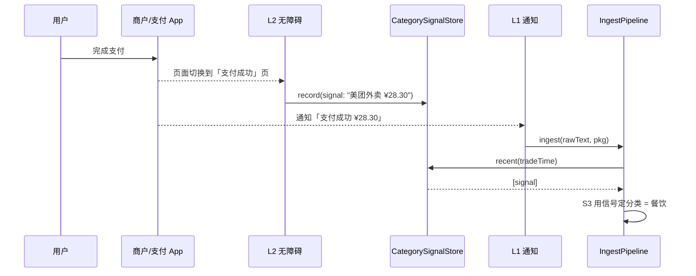
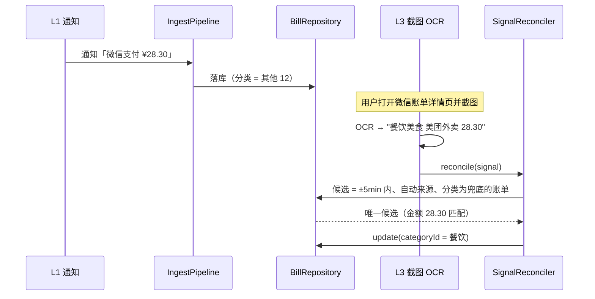
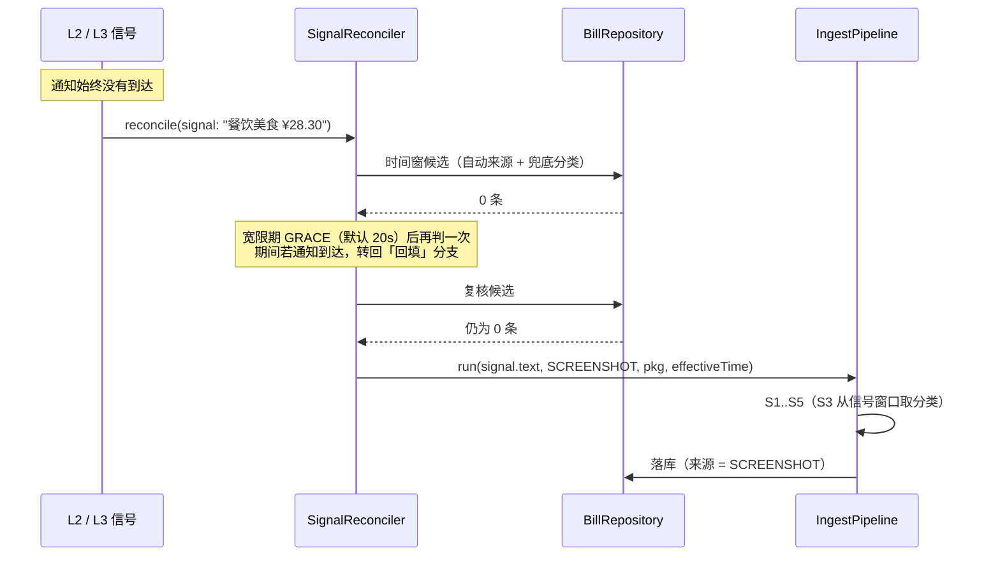

# 小凯记账 · 自动记账类别增强（L2/L3）技术设计文档

| 项目 | 内容 |
|---|---|
| 文档名称 | 设计文档_自动记账类别增强_L2L3_v1.0.0.md |
| 版本 | v1.1.0 |
| 创建日期 | 2026-09-19 |
| 适用范围 | `data` / `domain` / `core:db` / `core:prefs` / `core:common` / `feature` / `app` |
| 配套文档 | 设计文档_框架设计_v1.0.0.md（v1.1.18）、设计文档_代码规范_v1.0.0.md（v1.1.1） |
| 前置状态 | L1 通知采集、L4 手动记账 已实现；L2 无障碍、L3 截图 OCR 未实现 |

### 变更记录

| 版本 | 日期 | 修订人 | 说明 |
|---|---|---|---|
| v1.0.0 | 2026-09-19 | — | 首版：确立「类别信号（CategorySignal）」统一收口，给出 L2 无障碍与 L3 截图 OCR 的完整设计、自动回填机制、权限/清单/DI/迁移/里程碑/风险 |
| v1.1.0 | 2026-09-19 | — | **需求变更：L2/L3 亦可独立成账** —— 信号在时间窗内匹配不到账单时自行生成新账单；新增 `SignalReconciler`（匹配优先、建账兜底、宽限期防重）、`SignalTextParser`（金额/交易时间抽取）、`SourceType.ACCESSIBILITY/SCREENSHOT`；回填窗口由 ±10min 收敛为 ±5min |
| v1.2.0 | 2026-09-19 | — | **需求变更：新增「确认卡片」**（§13.6、M-L2-4）—— 识别并落库成功后自动弹出半透明卡片，供用户当场改分类 / 撤销；**保持「先记账再给改撤入口」的顺序**，不做「确认后才记账」；另将微信继续留在 L2 白名单（竞品实测无障碍可读微信页面），列入真机验证项 |

---

## 目录

1. [背景与目标](#1-背景与目标)
2. [术语澄清：分类 vs 账户](#2-术语澄清分类-vs-账户)
3. [现状基线](#3-现状基线)
4. [总体架构](#4-总体架构)
5. [核心抽象：类别信号](#5-核心抽象类别信号)
6. [分类路由优先级](#6-分类路由优先级)
7. [信号处理：优先匹配、否则建账（SignalReconciler）](#7-信号处理优先匹配否则建账signalreconciler)
8. [L2 · 无障碍设计](#8-l2--无障碍设计)
9. [L3 · 截图 OCR 设计](#9-l3--截图-ocr-设计)
10. [数据层改动](#10-数据层改动)
11. [配置、诊断与状态](#11-配置诊断与状态)
12. [权限与 AndroidManifest](#12-权限与-androidmanifest)
13. [UI 与交互](#13-ui-与交互)
14. [依赖注入装配](#14-依赖注入装配)
15. [文件清单](#15-文件清单)
16. [测试计划](#16-测试计划)
17. [里程碑](#17-里程碑)
18. [风险登记](#18-风险登记)
19. [扩展预留与待确认项](#19-扩展预留与待确认项)

---

## 1. 背景与目标

### 1.1 问题陈述

L1 通知采集已能稳定「落到一笔账」，但**分类信息普遍缺失**。原因是通知正文的信息量天然有限：

```
支付宝：  「支付成功 ¥28.30」
微信支付：「已支付 ¥28.30」
招商银行：「您尾号1234账户10月01日快捷支付扣款28.30元」
```

这三类文本里能稳定提取的只有**金额**与**方向**；商户 / 场景词往往不在通知里，于是
`CategoryRouter` 匹配不到任何分类词，只能落到方向兜底分类：

| 方向 | 兜底分类 | id |
|---|---|---|
| `EXPENSE` | 其他 | 12 |
| `INCOME` | 其他收入 | 18 |
| `TRANSFER` | 还款 | 20 |

结果是：**账单记对了方向，却几乎全部堆在「其他」里**，分类统计失去意义。

### 1.2 设计目标

| # | 目标 |
|---|---|
| G1 | 引入 L2 无障碍与 L3 截图 OCR，为账单补全**分类**（账户不在本设计范围内，见 §2） |
| G2 | 三种来源（L1 文本 / L2 页面 / L3 截图）产出的分类线索**归一化到同一收口**，匹配逻辑只有一份 |
| G3 | 支持**前向**（信号先到、通知后到）与**后向**（通知先落库、信号后到）两条时序，后向自动回填 |
| G4 | 回填必须**保守且可诊断**：只改兜底分类、仅在候选唯一时改，绝不覆盖已命中的分类 |
| G5 | 隐私与性能可控：信号只在内存短时窗口存活、不落盘、不写日志；采集侧有开关与白名单 |
| G6 | **L2/L3 亦可独立成账**：信号在时间窗内匹配不到既有账单时，可由信号自行生成一笔新账单（见 §7） |
| G7 | 建账与 L1 **共用同一条 `IngestPipeline`**：金额闸门、方向、分类、账户、去重全部复用，不存在第二套落库逻辑 |

### 1.3 非目标

- **不改变账户路由**：账户仍由 `AccountRouter` 按包名决定；L2 用前台包名（多为商户 App，通常落空），L3 无包名时留空（见 §2）。
- **不做云端 OCR / 云端分类**：保持「离线优先」约束。
- **不做信号生成账单的独立编辑页**：生成的账单与通知账单同构，用户走既有编辑页即可。
- **不做用户可撤销的类别版本历史**：v1 选择「自动回填」，不保存原值快照（见 §19，后续可加 `categorySource` 列实现溯源）。
- **不保证「一定有账」**：信号抽不到金额或判不出方向时**不建账**（避免错账），由 L4 手动兜底。
- **不做新的快捷触发入口**：不引入悬浮球 / 敲击背面等入口，L4 维持既有二级页；这类入口留作后续可选增强（见 §19.1）。
  ⚠️ 注意区分：「**确认卡片**」（见 §13.6）是识别成功后**自动弹出**的结果卡片，不是需要用户主动点的快捷入口，两者不冲突。
- **L3 触发方式锁定为「自动监听新截图」**：不改为「用户主动上传」形态；但 §9.6 的性能五条约束为**强制准入条件**。

---

## 2. 术语澄清：分类 vs 账户

需求原话为「给账单归属类别」。本项目中「类别」存在两个易混概念，**本文只解决前者**：

| 概念 | 字段 | 取值示例 | 现状 | 本设计 |
|---|---|---|---|---|
| **分类（Category）** | `Bill.categoryId` | 餐饮 / 交通 / 购物 / 居住 | ❌ 通知里通常没有，落「其他」 | ✅ **L2/L3 的目标** |
| **账户（Account）** | `Bill.accountId` | 支付宝 / 微信 / 储蓄卡 | ✅ 已由 `AccountRouter` 按包名决定 | ❌ 不改动 |

`AccountRouter` 已实现「包名 → 账户」：

```kotlin
// data/parser/AccountRouter.kt
fun resolve(packageName: String?, source: SourceType): Long? = when (packageName) {
    in ALIPAY_PACKAGES -> ACCOUNT_ALIPAY    // 2
    in WECHAT_PACKAGES -> ACCOUNT_WECHAT    // 3
    in BANK_PACKAGES   -> ACCOUNT_BANK_CARD // 4
    else -> null
}
```

因此 **`AccountRouter` 的判定规则一行不改**：账户只由「与该笔账单关联的包名」决定 ——
L1 用通知包名、L2 建账用前台包名、L3 无包名时账户留空。
需要特别说明的是：L2 拿到的前台包名多是**商户 App**（美团 / 京东 / 滴滴），
在 `AccountRouter` 里会落到 `else -> null`，因此 **L2 建出的账通常没有账户** ——
分类才是它的贡献（见 §8.4）。

本文的设计主要作用于 **S3 分类路由**（`CategoryRouter`）；
当信号需要独立成账时，还会**复用** S5 去重与落库（见 §7.2），但同样不修改它们的实现。

---

## 3. 现状基线

### 3.1 层级现状

| 层级 | 设计意图 | 现状 | 关键类 |
|---|---|---|---|
| **L1** | 通知监听，全自动记账 | ✅ 已实现 | `KaiNotificationListener` → `NotificationCaptureBridge` → `NotificationCapture` → `BillIngestor` → `IngestPipeline` |
| **L2** | 无障碍读 App 名 / 详情页 → 分类；**必要时独立成账** | ❌ 不存在 | — |
| **L3** | 截图 OCR 读分类；**必要时独立成账** | ❌ 不存在 | — |
| **L4** | 手动记账兜底 | ✅ 已实现 | `RecordViewModel` → `RecordBillUseCase` |

### 3.2 L1 流水线（本设计的接入点）

`IngestPipeline.run()` 现有五级：

```
S1 AmountGate       金额闸门   抽不到 → NO_AMOUNT（静默）
S2 DirectionRouter  方向路由   支出/收入/转账 → 继续；待确认 → 入待确认；排除词 → EXCLUDED
S3 CategoryRouter   分类路由   方向内匹配商户词，未命中落该方向兜底分类   ← ★ 本设计的接入点
S4 AccountRouter    账户路由   按来源包名落账户                          ← 保持不变
S5                  去重落库   dedupHash 唯一索引；冲突即重复
```

**关键约束（现状）**：`IngestPipeline` 在 S5 构造 `Bill` 时 `categoryId` 一次性写死，落库后
没有任何途径再修正分类。本设计要在两处动刀：

1. **S3 增强**：`CategoryRouter` 除了读通知文本，还要读「类别信号窗口」；
2. **新增回填**：落库之后到达的信号，通过 `SignalReconciler` 修正**仍为兜底分类**的账单；
3. **复用同一流水线建账**：信号在时间窗内找不到可匹配账单时，直接调用 `IngestPipeline.run(...)`
   生成新账单（`SourceType` 取 `ACCESSIBILITY` / `SCREENSHOT`）—— 四级阶段与去重逻辑一行不改。

---

## 4. 总体架构

### 4.1 分层职责

```
┌──────────────────────────────────────────────────────────────────────┐
│  L4 手动记账（兜底）  RecordViewModel → RecordBillUseCase → BillRepository │
└──────────────────────────────────────────────────────────────────────┘

┌──────────────────────────────────────────────────────────────────────┐
│  L1 通知采集（主链路，必须能独立工作）                                      │
│  通知 → KaiNotificationListener → NotificationCapture                   │
│         → BillIngestor → IngestPipeline(S1..S5) → BillRepository        │
└──────────────────────────────────────────────────────────────────────┘
                                 ▲  S3 读取信号
                                 │
┌──────────────────────── 类别信号（CategorySignal）─────────────────────┐
│                                                                        │
│   CategorySignalStore  ←──  CategorySignalRecorder  ←── ┬              │
│   （内存 · ~15s 滑动窗口 · 不落盘）                        │              │
│                                                        │              │
│   L2 无障碍                                   L3 截图 OCR              │
│   KaiAccessibilityService                     ScreenshotObserver        │
│   → PageTextExtractor                         → ScreenshotReader        │
│   → CategorySignalRecorder                    → OcrEngine               │
│                                               → ScreenshotBillParser    │
│                                               → CategorySignalRecorder  │
└────────────────────────────────────────────────────────────────────────┘
                                 │
                                 ▼
┌──────────────────────────────────────────────────────────────────────┐
│  SignalReconciler：信号到达后的唯一决策入口                               │
│   ① 时间窗内命中唯一账单 → 回填分类（只改兜底分类）                          │
│   ② 窗口内无账单         → 宽限期后复核 → 仍无 → 交给 IngestPipeline 建账    │
│   ③ 命中多条候选         → 放弃（AMBIGUOUS），既不回填也不建账               │
└──────────────────────────────────────────────────────────────────────┘
                                 │ ② 建账（复用同一条流水线）
                                 ▼
                 IngestPipeline.run(signal.text, ACCESSIBILITY / SCREENSHOT)
```

### 4.2 两条时序

**前向（信号先到 / 同时到）** —— 典型场景：扫码支付，付款时前台就是支付宝/美团。



**后向（信号后到）** —— 典型场景：微信账单详情页，通知早已落库，用户稍后截图。



**第三条出路：无账可配 → 由信号建账（v1.1.0 新增）** —— 场景：微信未发通知 / 通知被漏采。



---

## 5. 核心抽象：类别信号

### 5.1 `CategorySignal`（领域无关的纯数据）

放在 `data` 模块（含 Android 概念的程度为零，但仅被采集层消费，无需进 `domain`）。

```kotlin
// data/src/main/java/com/kai/bill/data/capture/signal/CategorySignal.kt
package com.kai.bill.data.capture.signal

/**
 * 分类信号来源。
 *
 * 顺序即**可信度顺序**：无障碍读到的页面文本是用户当下真实所见的界面，
 * 比 OCR 更少出错；两者都低于「通知正文直接命中」（见 CategoryRouter）。
 */
enum class CategorySignalOrigin {
    /** L2：无障碍读取到的当前页面可见文本 */
    ACCESSIBILITY,
    /** L3：截图 OCR 得到的文本 */
    SCREENSHOT
}

/**
 * 一条分类线索 —— L2/L3 的产出物。
 *
 * 它是「候选账单 + 候选分类」的合体：既可能用于给既有账单**补分类**，
 * 也可能在找不到可匹配账单时**独立成账**（见 SignalReconciler）。
 * 但它本身不直接落库 —— 建账一律复用 [com.kai.bill.data.ingest.IngestPipeline]，
 * 以保证金额 / 方向 / 去重口径与 L1 完全一致。
 *
 * @property origin 信号来源，用于排序、诊断，以及建账时的 SourceType 选择
 * @property packageName 采集信号时前台的 App 包名；用于「包名 → 默认分类」，
 *           L2 建账时也用于账户路由（AccountRouter）；L3 无法得知来源，恒为 null
 * @property text 用于分类匹配与建账的文本（已清洗为单行、已截断上限）
 * @property amountCents 页面/截图中抽到的金额（分）；抽不到时为 null。
 *           用途有二：① 回填时筛候选；② 建账时作为金额
 * @property tradeTimeMillis 从文本中抽到的**交易时间**；抽不到时为 null
 * @property capturedAtMillis 信号采集时刻（毫秒），是 [tradeTimeMillis] 的兜底
 */
data class CategorySignal(
    val origin: CategorySignalOrigin,
    val packageName: String?,
    val text: String,
    val amountCents: Long?,
    val tradeTimeMillis: Long?,
    val capturedAtMillis: Long
) {
    /**
     * 有效交易时间：优先用文本里抽到的交易时间。
     *
     * 为什么重要：L3 截图可能在交易发生后几分钟才产生，若一律以截图时刻当交易时间，
     * 账单会记在错误的时点（甚至跨天/跨月），也会让「与既有通知账单匹配」失效。
     * 微信 / 支付宝账单详情页通常含「交易时间」，抽到即用。
     */
    val effectiveTimeMillis: Long get() = tradeTimeMillis ?: capturedAtMillis
}
```

> **为什么不把信号做成 `BillSource`**：`BillSource` 的契约是「产出原始文本 → 交给 `BillIngestor` 落库」，
> 只有一条落库路径。而信号的语义是「**先尝试匹配既有账单、匹配不到才建账**」，
> 这条决策必须发生在落库之前。因此把决策收在 `SignalReconciler`，
> 真正要建账时**调用同一套 `IngestPipeline`** —— 既不破坏 L1 主链路的清晰度，
> 也不产生第二套落库实现。

### 5.2 `CategorySignalStore`（短时信号窗口）

```kotlin
// data/.../capture/signal/CategorySignalStore.kt
@Singleton
class CategorySignalStore @Inject constructor(
    private val clock: Clock
) {
    private val lock = Any()
    private val signals = ArrayDeque<CategorySignal>()

    /** 记录一条信号；顺带清理过期项，并保证容量上限 */
    fun record(signal: CategorySignal) = synchronized(lock) {
        val cutoff = clock.nowMillis() - MAX_AGE_MILLIS
        signals.addLast(signal)
        signals.removeAll { it.capturedAtMillis < cutoff }
        while (signals.size > MAX_SIGNALS) signals.removeFirst()
    }

    /**
     * 取参照时刻附近的信号，**新的在前**。
     *
     * 判定用「采集时刻**或**有效交易时刻落在窗口内」：
     * - 通知场景：流水线传 `postTime`，与 `capturedAtMillis` 基本重合 → 靠前者命中；
     * - 信号建账场景：流水线传 `effectiveTimeMillis`（可能是截图里抽到的交易时间，
     *   与截图时刻相差数分钟）→ 靠后者命中。
     * 若只判采集时刻，信号建账时会出现「自己的信号认不出自己」的 bug。
     */
    fun recent(referenceMillis: Long): List<CategorySignal> = synchronized(lock) {
        val from = referenceMillis - SIGNAL_TTL_MILLIS
        val to = referenceMillis + SIGNAL_TTL_MILLIS
        signals.filter { it.capturedAtMillis in from..to || it.effectiveTimeMillis in from..to }
            .sortedWith(
                // 升序：枚举声明顺序即可信度顺序（ACCESSIBILITY 在 SCREENSHOT 之前）
                compareBy<CategorySignal> { it.origin.ordinal }
                    .thenByDescending { it.capturedAtMillis }
            )
    }

    companion object {
        /** 信号有效期半径（毫秒）。15 秒：覆盖「页面停留 → 通知到达」的常见间隔，又不至于把上一次消费带进来 */
        const val SIGNAL_TTL_MILLIS = 15_000L
        /** 窗口容量上限，防止异常应用刷事件导致内存增长 */
        private const val MAX_SIGNALS = 32
        /** 最长留存时间（毫秒）。覆盖「建账宽限期 + 复核」后即可丢弃，避免旧信号长期驻留 */
        private const val MAX_AGE_MILLIS = 5 * 60_000L
    }
}
```

设计要点：

| 点 | 决策 | 理由 |
|---|---|---|
| 存储位置 | **内存**，不落盘 | 页面文本可能含隐私（余额、卡号尾号），落盘违背框架文档 §11.3 的隐私约定 |
| 匹配窗口 | 半径 15s，且**采集时刻与有效交易时刻任一命中即可** | 太短覆盖不了「先开页面后收通知」；只判采集时刻会让信号建账时认不出自己的信号 |
| 留存时长 | 5 分钟 | 需覆盖「建账宽限期 + 复核」；再久就没有价值 |
| 线程安全 | `synchronized` | 无障碍回调、截图观察者、流水线协程运行在不同线程；临界区极小，无需 `Mutex` 的挂起开销 |
| 容量 | 32 条 | 正常场景只有 1~2 条；上限只作异常兜底 |

### 5.3 `CategorySignalRecorder`（信号写入 + 触发决策）

```kotlin
// data/.../capture/signal/CategorySignalRecorder.kt
@Singleton
class CategorySignalRecorder @Inject constructor(
    private val store: CategorySignalStore,
    private val reconciler: SignalReconciler
) {
    private val scope = CoroutineScope(SupervisorJob() + Dispatchers.Default)

    /**
     * 写入一条信号，并异步交给 [SignalReconciler] 决策「回填还是建账」。
     *
     * 顺序不可换：**必须先 record 再 reconcile** ——
     * ① 若通知与信号几乎同时到达，「先入窗口」能让流水线的前向路径直接吃到这条信号；
     * ② 建账分支会调用 `IngestPipeline`，其 S3 正是从本窗口读信号，晚于建账就会丢分类。
     */
    fun record(signal: CategorySignal) {
        if (signal.text.isBlank()) return
        store.record(signal)
        scope.launch { runCatching { reconciler.reconcile(signal) } }
    }
}
```

### 5.4 `SignalTextParser`（信号文本 → 金额 / 交易时间）

L2/L3 的文本都是「一屏人话」，从中抽金额与时间**不能用通知那套「取第一个匹配」的做法**：

```kotlin
// data/.../capture/signal/SignalTextParser.kt
/**
 * 从页面 / OCR 文本中抽取建账所需的金额与交易时间。
 *
 * 与 L1 的 [com.kai.bill.data.parser.AmountGate] 的差别：
 * - `AmountGate` 面向**单笔通知**（文本短、通常只有一笔），取首个货币语境数字即可；
 * - 本解析器面向**整页文本**（可能同时出现订单号、余额、优惠、多笔金额），
 *   因此必须用「金额关键词邻近」而非「位置靠前」来判定；
 * - **宁可不抽，也不抽错**：拿不准时返回 null，让信号只走回填、不建账。
 */
object SignalTextParser {

    /** 金额关键词：只有挨着这些词的数字才被认为是「这笔交易的金额」 */
    private val AMOUNT_ANCHORS = listOf(
        "实付", "实付款", "付款金额", "支付金额", "订单金额", "合计", "金额", "支付", "收款"
    )

    /** 带货币语境的金额；与 AmountGate 同口径（必须有 ¥/￥ 或「元」） */
    private val AMOUNT = Regex("""[¥￥]\s*([\d,]+(?:\.\d{1,2})?)|([\d,]+(?:\.\d{1,2})?)\s*元""")

    /** 交易时间：覆盖 "2026-09-19 15:32" / "2026年9月19日 15:32" / "09-19 15:32" 三种写法 */
    private val TRADE_TIME = Regex("""(\d{4})[-年/](\d{1,2})[-月/](\d{1,2})日?\s*(\d{1,2}):(\d{2})""")

    /** @return 金额（分）；无法确定时返回 null */
    fun extractAmountCents(text: String): Long?

    /** @return 交易时间（毫秒，按系统时区解析）；抽不到时返回 null */
    fun extractTradeTimeMillis(text: String, clock: Clock): Long?
}
```

金额判定规则（逐条可单测）：

| # | 规则 |
|---|---|
| 1 | 收集所有货币语境金额及其出现位置 |
| 2 | 若某金额与某个 `AMOUNT_ANCHORS` 词的距离 ≤ 8 个字符 → 采纳（多个时取最靠近的） |
| 3 | 若无「邻近金额关键词」者，且全页**只有一个**货币语境金额 → 采纳它 |
| 4 | 其余情况 → 返回 null（不猜） |

> L3 的 `ScreenshotBillParser` **直接复用本解析器**，不再自写正则 ——
> 截图与页面文本的解析口径必须一致，否则「同一笔由 L2 还是 L3 处理」会得出不同结果。

---

## 6. 分类路由优先级

### 6.1 现状

```kotlin
// data/parser/CategoryRouter.kt（现状）
fun resolve(rawText: String, direction: BillType, source: SourceType, tables: MatchKeywordTables): Long? =
    KeywordMatcher.best(
        candidates = tables.category.filter { it.direction == direction },
        rawText = rawText,
        source = source,
        reserved = tables.reserved
    )?.categoryId

fun fallbackOf(direction: BillType): Long = when (direction) { ... }
```

### 6.2 增强后

```kotlin
/** 分类结果 + 它是怎么来的 —— 回填资格判定与新诊断都依赖「是否兜底」 */
data class CategoryMatch(
    val categoryId: Long,
    val origin: CategoryMatchOrigin,
    val matchedKeyword: String?
)

enum class CategoryMatchOrigin {
    /** 通知正文命中分类词（最高可信） */
    NOTIFICATION_TEXT,
    /** 类别信号的页面文本命中（L2/L3） */
    SIGNAL_TEXT,
    /** 类别信号的包名默认分类（L2，仅支出方向） */
    SIGNAL_PACKAGE,
    /** 方向兜底（其他 / 其他收入 / 还款） */
    FALLBACK
}

fun resolve(
    rawText: String,
    direction: BillType,
    source: SourceType,
    tables: MatchKeywordTables,
    signals: List<CategorySignal> = emptyList()
): CategoryMatch
```

匹配顺序（**不可调换**）：

| 序 | 来源 | 输入文本 | origin | 说明 |
|---|---|---|---|---|
| 1 | 通知正文 | `rawText` | `NOTIFICATION_TEXT` | 通知是这笔交易的权威来源，正文命中优先 |
| 2 | 信号页面文本 | `signal.text` | `SIGNAL_TEXT` | 逐条按「origin 降序（无障碍 > 截图）→ 采集时间降序」尝试 |
| 3 | 信号包名默认 | `signal.packageName` | `SIGNAL_PACKAGE` | 查 `PackageCategoryPreset`，**仅 `EXPENSE` 方向生效** |
| 4 | 兜底 | — | `FALLBACK` | 同现有 `fallbackOf` |

要点：

- **复用同一套 `KeywordMatcher` 与词表**：信号文本走的是与通知正文完全相同的匹配函数，
  只是换了输入串。这样「多级路由」的排序口径（优先级 → 词长 → 位置）只有一份实现，
  不会出现「通知按一套、页面按另一套」的漂移。
- **信号按可信度排序，只取首个命中**：不合并多个信号，避免「两条信号各命中一个分类」时
  产生不确定性；取最优的一条即可。
- **`reserved` 保留词同样生效**：页面文本里出现「支付宝」时，其中的「支付」不会误触发。

### 6.3 兜底分类集合的显式暴露

回填必须能判断「这条账单的分类还是不是兜底值」。当前兜底 id 是 `private companion object` 里的
三个常量，需要提升为公开契约：

```kotlin
/**
 * 方向兜底分类 id 集合。
 *
 * **回填与建账判定都只认这三个**：命中过任意分类词（或已被回填过）的账单
 * 既不进候选、也不会被再次改写。
 */
val fallbackIds: Set<Long> = setOf(CATEGORY_OTHER_EXPENSE, CATEGORY_OTHER_INCOME, CATEGORY_REPAYMENT)

fun isFallback(categoryId: Long): Boolean = categoryId in fallbackIds
```

> ⚠️ 这三个 id 是 `DefaultCategories` 的硬约定（12 / 18 / 20），改动会让历史账单掉进「未分类」，
> 因此**只能新增、不能改值**。`fallbackIds` 的存在把这条约束从注释变成了可执行代码。

> ✅ **已确认（2026-09-19）：回填允许修改的范围就是这三个兜底值 `{12, 18, 20}`**，不做进一步收窄 ——
> 支出（其他）、收入（其他收入）、转账（还款）三个方向的兜底账单都可被补分类。
> 之所以把这个集合单独抽出来，就是为了让「改小范围」这件事只需改一处：
> 将来若只想允许改支出，把 `fallbackIds` 收成 `{12}` 即可 ——
> 候选筛选（SQL）、回填资格判定、诊断全部只依赖这一个集合，不会漏改。

---

## 7. 信号处理：优先匹配、否则建账（SignalReconciler）

### 7.1 决策流程

`SignalReconciler.reconcile(signal)` 是信号到达后的**唯一决策入口**，三种结局：

| 结局 | 条件 | 动作 |
|---|---|---|
| **回填** | 候选中按金额收窄后**恰好一条** | 用信号文本定分类 → 更新该账单 `categoryId` |
| **放弃** | 收窄后**多于一条**，或有候选但信号定不出分类 | 写 `AMBIGUOUS` / `NO_MATCH` 诊断，不回填、**也不建账** |
| **建账** | 收窄后**零条**，且宽限期后复核仍为零 | 调用 `IngestPipeline.run(...)` 生成新账单 |

```
                ┌──────────────────────────────┐
 signal 到达 ─▶ │ 查询候选账单                  │
                │ time ≈ effectiveTime ±5min   │
                │ source ∈ 自动采集             │
                │ categoryId ∈ 兜底值           │
                └──────────────┬───────────────┘
                               │
             ┌─────────────────┼─────────────────┐
             ▼                 ▼                 ▼
          恰好 1 条          >1 条              0 条
             │                 │                 │
             ▼                 ▼                 ▼
       信号能定分类?      AMBIGUOUS         ┌─ 延迟 GRACE ─┐
        ├ 能 → 回填       （不建账）          │  复核候选     │
        └ 不能 → NO_MATCH                   └──────┬───────┘
                    （不建账）              0 条 ◀──┴──▶ 按条数回到上面分支
                                             │
                                             ▼
                                   IngestPipeline 建账（S1..S5）
```

### 7.2 实现

```kotlin
// data/.../ingest/SignalReconciler.kt
@Singleton
class SignalReconciler @Inject constructor(
    private val billRepository: BillRepository,
    private val categoryRouter: CategoryRouter,
    private val keywords: MatchKeywordTables,
    private val ingestor: BillIngestor,      // ★ 建账复用 L1 同一条流水线
    private val clock: Clock,
    private val kaiPrefs: KaiPrefs
) {
    /**
     * 处理一条信号：能回填就回填；否则（宽限期后复核仍无候选）建账。
     *
     * 全程包在调用方（CategorySignalRecorder）的 runCatching 里，
     * 因此这里可以放心让异常冒泡 —— 采集链路不因一次信号处理失败而中断。
     */
    suspend fun reconcile(signal: CategorySignal): ReconcileOutcome {
        when (val step = matchOnce(signal)) {
            is MatchStep.Done -> return step.outcome
            MatchStep.NoCandidate -> Unit
        }

        // 宽限期：给「通知稍后到达」留出窗口，避免与 L1 各记一笔（见 7.3）
        delay(GRACE_DELAY_MILLIS)

        when (val step = matchOnce(signal)) {
            is MatchStep.Done -> return step.outcome
            MatchStep.NoCandidate -> Unit
        }
        return createBill(signal)
    }

    /** 一次「查候选 → 尝试回填」；@see MatchStep */
    private suspend fun matchOnce(signal: CategorySignal): MatchStep {
        val candidates = billRepository.findEnrichCandidates(
            startMillis = signal.effectiveTimeMillis - MATCH_WINDOW_MILLIS,
            endMillis = signal.effectiveTimeMillis + MATCH_WINDOW_MILLIS,
            fallbackCategoryIds = categoryRouter.fallbackIds
        )

        // 金额是更强的身份：信号带金额时先按金额收窄，能大幅降低「同额两笔」的歧义
        val narrowed = signal.amountCents
            ?.let { amount -> candidates.filter { it.amountCents == amount } }
            ?: candidates
        if (narrowed.isEmpty()) return MatchStep.NoCandidate

        // 只认唯一候选：宁可漏回填，也不能改错账
        val bill = narrowed.singleOrNull()
            ?: return MatchStep.Done(record(ReconcileOutcome.AMBIGUOUS, signal))

        // 此处刻意不传 signals：回填的输入就是信号本身，再读信号窗口会自我引用
        val match = categoryRouter.resolve(signal.text, bill.type, SourceType.NOTIFICATION, keywords)
        if (match.origin == CategoryMatchOrigin.FALLBACK) {
            // 有账单可配，但信号也定不出分类 → 什么都不做，**绝不能转去建账**（会多记一笔）
            return MatchStep.Done(record(ReconcileOutcome.NO_MATCH, signal))
        }

        billRepository.save(bill.copy(categoryId = match.categoryId, updatedAt = clock.nowMillis()))
        return MatchStep.Done(record(ReconcileOutcome.ENRICHED, signal))
    }

    /**
     * 由信号生成一笔新账单 —— **完全复用 L1 的流水线**。
     *
     * 这里没有任何「怎么建账」的重复逻辑：S1 金额闸门、S2 方向、S3 分类（自动从信号窗口取）、
     * S4 账户（L2 用前台包名）、S5 去重落库全部由 IngestPipeline 承担。
     */
    private suspend fun createBill(signal: CategorySignal): ReconcileOutcome {
        val result = ingestor.ingest(
            rawText = signal.text.take(MAX_RAW_TEXT_CHARS),
            source = signal.origin.toSourceType(),
            packageName = signal.packageName,
            eventTimeMillis = signal.effectiveTimeMillis
        )
        // 不写 else：CaptureResult 已穷尽，新增枚举项时编译期会在这里报错
        val outcome = when (result) {
            CaptureResult.PARSED_AND_SAVED -> ReconcileOutcome.CREATED
            CaptureResult.DUPLICATE_SKIPPED -> ReconcileOutcome.DUPLICATE  // 期间 L1 已落账，正常
            CaptureResult.NEEDS_REVIEW, CaptureResult.PENDING_DUPLICATE -> ReconcileOutcome.PENDING
            CaptureResult.NO_AMOUNT -> ReconcileOutcome.NO_AMOUNT
            CaptureResult.EXCLUDED -> ReconcileOutcome.EXCLUDED
            CaptureResult.PARSE_FAILED, CaptureResult.FILTERED_OUT -> ReconcileOutcome.FAILED
        }
        return record(outcome, signal)
    }

    private suspend fun record(outcome: ReconcileOutcome, signal: CategorySignal): ReconcileOutcome {
        kaiPrefs.recordSignalResult(outcome.name, signal.text, clock.nowMillis())
        return outcome
    }

    private sealed interface MatchStep {
        /** 已有结论（回填 / 放弃），不再进入建账分支 */
        data class Done(val outcome: ReconcileOutcome) : MatchStep
        /** 无候选 → 允许进入建账分支 */
        data object NoCandidate : MatchStep
    }

    private companion object {
        /** 匹配与回填的搜索半径（毫秒）。±5 分钟：用户明确定下的窗口（见 §19） */
        const val MATCH_WINDOW_MILLIS = 5 * 60_000L

        /** 建账宽限期（毫秒）。等通知落地后再复核，避免与 L1 重复记账（见 7.3） */
        const val GRACE_DELAY_MILLIS = 20_000L

        /** 写入账单 rawText 的截断长度，与诊断口径一致，避免整页文本进库 */
        const val MAX_RAW_TEXT_CHARS = 500
    }
}

/** 结果编码，取值必须与 §11.3 文案表同步 */
enum class ReconcileOutcome {
    ENRICHED, AMBIGUOUS, NO_MATCH, CREATED, DUPLICATE, PENDING, NO_AMOUNT, EXCLUDED, FAILED
}

/** 信号来源 → 账单来源；两个枚举一一对应，集中在一处避免散落的 when */
private fun CategorySignalOrigin.toSourceType(): SourceType = when (this) {
    CategorySignalOrigin.ACCESSIBILITY -> SourceType.ACCESSIBILITY
    CategorySignalOrigin.SCREENSHOT -> SourceType.SCREENSHOT
}
```

### 7.3 为什么必须「宽限期」后再建账

| 方案 | 问题 |
|---|---|
| 信号一到就建账 | 扫码支付时信号通常比通知早约 0.5s，会先建一笔；通知到达后只能靠 `existsInWindow` 的 **3 秒**窗去重兜住 —— 通知一旦延迟超过 3 秒就**多记一笔** |
| **延迟 `GRACE_DELAY_MILLIS` 后复核再建（采用）** | 宽限期内通知若到达 → 复核命中 → 转为回填，几乎消除重复；代价是账单晚出现约 20 秒 |

宽限期同时覆盖两种时序：

- **信号早于通知**：等通知落库 → 复核命中 → 回填（不重复建账）；
- **通知永远不会来**：复核仍为空 → 建账（这正是本次需求要覆盖的场景）。

> 进程在宽限期内被杀会丢掉这次建账。缓解：L3 有冷启补扫、L2 会随下一次页面变化重新产生信号；
> 实在丢失由 L4 手动兜底。若实测丢失率不可接受，再把建账改由 WorkManager 持久化调度（见 §19.1）。

### 7.4 建账的四道闸门（全部来自既有流水线）

| 闸门 | 来源 | 不通过时的结果 |
|---|---|---|
| 金额 | `AmountGate`（S1） | `NO_AMOUNT` —— 不建账 |
| 方向 | `DirectionRouter`（S2） | 判不出 → 入待确认；命中排除词 → `EXCLUDED` |
| 分类 | `CategoryRouter`（S3） | 未命中 → 落方向兜底分类（仍会建账，之后可被回填） |
| 去重 | `DedupKey` + `existsInWindow`（S5） | 与既有账单重复 → `DUPLICATE_SKIPPED` |

**这是本设计最重要的复用点**：信号的「建账」与 L1 的「落账」是同一段代码，
因此金额单位、方向语义、去重强度、账户路由**不可能出现两套口径**。

### 7.5 回填不改动的字段

回填**只改 `categoryId` 与 `updatedAt`**，不改 `dedupHash`（分类不参与去重键，见 `DedupKey.build`），
因此不会触发唯一索引冲突，也不会把一笔账变成两笔。

### 7.6 一个必须记录的限制：L3 截图的建账时间

L3 的 `effectiveTimeMillis` 优先取 OCR 抽到的**交易时间**（§5.4）。
若截图里没有交易时间，则退回截图时刻 —— 此时若用户截的是**很久以前的账单**，
回填窗口（±5min）匹配不到历史账单，就可能**凭空多记一笔**。

缓解：

- `ScreenshotBillParser` 必须尽力抽交易时间（微信 / 支付宝详情页均有「交易时间」）；
- 建账仍走 S5 去重，与既有账单（同金额同类型、秒级）冲突时不落库；
- 在文档与设置页说明该限制，用户可自行删除错误账单。

---

## 8. L2 · 无障碍设计

### 8.1 组件

```
data/src/main/java/com/kai/bill/data/capture/accessibility/
├── KaiAccessibilityCore.kt        # AccessibilityService 实现体（抽象类，含全部逻辑）
├── PageTextExtractor.kt           # 节点树 → 可见文本（纯函数，可单测）
├── AccessibilityWhitelist.kt      # 无障碍专属白名单（比通知白名单更宽）
└── AccessibilityCapture.kt        # 状态门面：isAvailable / 启停无操作说明
data/src/main/java/com/google/android/accessibility/selecttospeak/
└── SelectToSpeakService.kt        # 清单里真正声明的服务：微信白名单类名兼容壳（零逻辑）
data/src/main/res/xml/
└── accessibility_service_config.xml
```

> 注：清单中声明的服务为 `SelectToSpeakService`（零逻辑兼容壳），实现见 `KaiAccessibilityCore`。

### 8.2 服务实现

```kotlin
@AndroidEntryPoint
class KaiAccessibilityService : AccessibilityService() {

    @Inject lateinit var recorder: CategorySignalRecorder
    @Inject lateinit var kaiPrefs: KaiPrefs
    @Inject lateinit var clock: Clock

    private val scope = CoroutineScope(SupervisorJob() + Dispatchers.Default)

    override fun onServiceConnected() {
        super.onServiceConnected()
        scope.launch { kaiPrefs.setAccessibilityEnabled(true) }
    }

    override fun onAccessibilityEvent(event: AccessibilityEvent?) {
        val pkg = event?.packageName?.toString() ?: return
        if (!AccessibilityWhitelist.isWatched(pkg)) return

        // PERF: onAccessibilityEvent 在主线程回调，节点遍历是 CPU 密集操作，
        //       必须挪到 Default，否则输入法/列表滚动会明显掉帧
        val text = PageTextExtractor.extract(rootInActiveWindow) ?: return
        if (text.isBlank()) return

        recorder.record(
            CategorySignal(
                origin = CategorySignalOrigin.ACCESSIBILITY,
                packageName = pkg,
                text = text,
                // 页面数字多，改用「金额关键词邻近」规则抽取；抽不到即 null，
                // 此时信号只能回填、不能建账（宁可不建，也不建错账）
                amountCents = SignalTextParser.extractAmountCents(text),
                tradeTimeMillis = SignalTextParser.extractTradeTimeMillis(text, clock),
                capturedAtMillis = System.currentTimeMillis()
            )
        )
    }

    override fun onInterrupt() = Unit

    override fun onUnbind(intent: Intent?): Boolean {
        scope.launch { kaiPrefs.setAccessibilityEnabled(false) }
        return super.onUnbind(intent)
    }

    override fun onDestroy() {
        scope.cancel()
        super.onDestroy()
    }
}
```

> **L2 的金额为什么必须另写规则**：支付成功页通常同时出现「订单号」「金额」「余额」「优惠」等一屏数字，
> `AmountGate` 取第一个匹配会频繁抽错，进而导致**建账金额错误**。
> 因此 L2 改用 `SignalTextParser` 的「金额关键词邻近」规则（§5.4），**抽不到就为 null，信号只回填不建账**。
> 这与本设计「宁可漏记也不记错」的总体取向一致。

### 8.3 服务配置

`data/src/main/res/xml/accessibility_service_config.xml`：

```xml
<?xml version="1.0" encoding="utf-8"?>
<accessibility-service xmlns:android="http://schemas.android.com/apk/res/android"
    android:accessibilityEventTypes="typeWindowStateChanged|typeWindowContentChanged"
    android:accessibilityFeedbackType="feedbackGeneric"
    android:accessibilityFlags="flagDefault"
    android:canRetrieveWindowContent="true"
    android:notificationTimeout="300"
    android:description="@string/accessibility_service_description" />
```

| 配置 | 取值 | 理由 |
|---|---|---|
| `accessibilityEventTypes` | 窗口状态 / 内容变化 | 只有「页面切换」与「页面内容更新」有意义；不收点击、滚动、文本输入（隐私 + 性能） |
| `notificationTimeout` | 300ms | 页面切换会连续触发多次事件，节流后只保留稳定态 |
| `canRetrieveWindowContent` | true | 读页面文本的前提 |
| `packageNames` | **不设** | 见下方说明 |

> **为什么不在 XML 里限定 `packageNames`**：XML 无法引用 Kotlin 常量，写了就等于把白名单
> 复制成第二份，日后必然与代码里的白名单漂移。改为**在 `onAccessibilityEvent` 首行用
> `AccessibilityWhitelist.isWatched(pkg)` 过滤**：事件在内存中即时丢弃，不持久化、不写日志。
> 「通知白名单」与「无障碍白名单」共用一套判断思路，但**内容不同**（见 §8.4）。

### 8.4 `AccessibilityWhitelist` 与 `PackageCategoryPreset`

L2 要解决「当前软件名 → 分类」，因此白名单必须**比通知白名单更宽**：
通知白名单只放「会发出账单通知的 App」（支付宝/微信/银行/短信），
而无障碍要看的是**用户付款时前台的那个消费类 App**（美团、滴滴、京东……）。

```kotlin
// data/.../capture/accessibility/AccessibilityWhitelist.kt
object AccessibilityWhitelist {

    private val WATCHED = setOf(
        // 支付 / 收款
        "com.eg.android.AlipayGphone", "com.eg.android.AlipayGphoneRC", "com.tencent.mm",
        // 外卖 / 生鲜
        "com.sankuai.meituan", "com.sankuai.meituan.takeoutnew", "me.ele", "com.dingdong.picmap",
        // 出行
        "com.sdu.didi.psnger",
        // 电商
        "com.taobao.taobao", "com.jingdong.app.mall", "com.xunmeng.pinduoduo",
        // 咖啡 / 茶饮
        "com.luckin.coffee", "com.starbucks.cn"
    )

    fun isWatched(packageName: String): Boolean = WATCHED.contains(packageName)
}
```

```kotlin
// data/.../presets/PackageCategoryPreset.kt
/**
 * 「前台 App 包名 → 默认分类」预设。
 *
 * 这是 L2「判断当前软件名」那条路径的词表，**优先级低于页面文本匹配**：
 * 页面文本是用户真实所见的界面（「美团外卖」），比 App 名更具体。
 * 因此它只在前两级都没命中时生效，且**仅对支出方向**有效
 * （这些 App 不会产生收入账单，若方向是收入说明判断有误，不应误配分类）。
 */
object PackageCategoryPreset {

    /**
     * 键为包名，值为 `DefaultCategories` 的分类 id。
     *
     * 一级与二级 id **混用是允许的**（与 `CategoryKeyword` 约定一致）：
     * 「美团 → 21 早午晚餐」比「美团 → 1 餐饮」更能反映实际消费场景；
     * 拿不准时宁可落到一级（如「淘宝 → 3 购物」），不要把语义猜细。
     */
    private val DEFAULTS: Map<String, Long> = mapOf(
        // 外卖 / 生鲜 → 餐饮(1) 下钻
        "com.sankuai.meituan" to 21L,             // 早午晚餐
        "com.sankuai.meituan.takeoutnew" to 21L,
        "me.ele" to 21L,
        "com.dingdong.picmap" to 25L,             // 烹饪食材
        // 咖啡 / 茶饮 → 咖啡奶茶(24)
        "com.luckin.coffee" to 24L,
        "com.starbucks.cn" to 24L,
        // 出行 → 打车(27)
        "com.sdu.didi.psnger" to 27L,
        // 电商 → 购物(3) 一级
        "com.taobao.taobao" to 3L,
        "com.jingdong.app.mall" to 3L,
        "com.xunmeng.pinduoduo" to 3L
    )

    fun categoryIdOf(packageName: String?, direction: BillType): Long? =
        if (direction != BillType.EXPENSE) null else packageName?.let(DEFAULTS::get)
}
```

> ⚠️ 上表 id 已按 `DefaultCategories` 实际值核对（餐饮子类 21~25、交通子类 26~30、购物子类 31~35）。
> 词表本身与 `DefaultCategoryKeywords` 一样是「可热更新」的候选（见 §19）；
> **新增条目时必须回查 `DefaultCategories`，写错 id 会让账单落进一个语义不符的分类**，
> 建议配一条断言「所有映射 id 必须存在于 `DefaultCategories.all`」的单测。

### 8.5 文本抽取 `PageTextExtractor`

```kotlin
object PageTextExtractor {

    /** 节点数上限：正常账单页远小于 400；超限说明撞上了无限/超长列表，及时止损 */
    private const val MAX_NODES = 400
    /** 深度上限：防止深层嵌套导致的递归开销 */
    private const val MAX_DEPTH = 30
    /** 文本长度上限：够分类匹配即可，截断也顺带降低内存与隐私暴露面 */
    private const val MAX_CHARS = 2_000

    /**
     * 从无障碍节点树提取可见文本。
     *
     * 只取 [AccessibilityNodeInfo.text] 与 `contentDescription`：
     * 前者是界面上的字，后者是无障碍朗读的语义描述，两者都可能含商户名。
     *
     * @param root 活动窗口根节点；为 null（无窗口/无权限）时返回 null
     * @return 去重、压缩空白后的单行文本；无有效文本时返回 null
     */
    fun extract(root: AccessibilityNodeInfo?): String? { ... }
}
```

实现要点：

1. **广度优先遍历**，用 `ArrayDeque<Pair<AccessibilityNodeInfo, Int>>`，不用递归（避免深树栈溢出）；
2. 收集 `node.text` 与 `node.contentDescription`，用 `LinkedHashSet` 去重并保持出现顺序；
3. 遇到 `MAX_NODES` / `MAX_DEPTH` 立即停止遍历；
4. 结果 `joinToString(" ")` 后压缩连续空白、`take(MAX_CHARS)`；
5. 不做 `recycle()`：API 33 起已废弃且为无操作，调用反而触发 lint 警告。

---

## 9. L3 · 截图 OCR 设计

### 9.1 OCR 引擎选型

| 方案 | 决策 | 理由 |
|---|---|---|
| **ML Kit `text-recognition-chinese`（本地）** | ✅ **采用** | 离线、免费、图片不出设备，符合框架文档「离线优先」与隐私约定 |
| 云端 OCR | ❌ | 需要网络、有隐私风险、违背项目约束 |
| Tesseract | ❌ | 中文识别质量与集成成本均劣于 ML Kit |

依赖声明（`gradle/libs.versions.toml`）：

```toml
[versions]
mlkitTextRecognitionChinese = "16.0.1"

[libraries]
mlkit-text-recognition-chinese = { module = "com.google.mlkit:text-recognition-chinese", version.ref = "mlkitTextRecognitionChinese" }
```

`data/build.gradle.kts` 新增：

```kotlin
// L3 截图记账：本地中文 OCR（bundled 模型，离线可用，不上传图片）
implementation(libs.mlkit.text.recognition.chinese)
```

> bundled 版本模型随 APK 分发，体积增加约几 MB，但**无需依赖 Google Play 服务**，
> 在国内 ROM 上更可靠。自用场景下体积不是问题。

### 9.2 截图监听（自动）

用户决策：**自动监听新截图** —— 用户在微信账单详情页手动截图后，App 自动识别。

```kotlin
// data/.../capture/screenshot/ScreenshotObserver.kt
/**
 * 监听媒体库变化，识别「新的截图」并回调。
 *
 * 为什么监听 MediaStore 而不是用 MediaProjection：
 * - MediaProjection 每次抓屏都要用户授权，做不到「无感」；
 * - 截图已由系统写进媒体库，读它不需要额外授权交互（只需一次媒体读取权限）。
 */
class ScreenshotObserver(
    private val context: Context,
    private val onScreenshot: (Uri) -> Unit
) : ContentObserver(Handler(Looper.getMainLooper())) {

    override fun onChange(selfChange: Boolean, uri: Uri?) {
        runCatching { queryLatestScreenshot()?.let(onScreenshot) }
    }
}
```

判定「这是截图」的依据（按 ROM 兼容性排序，命中任一即可）：

| # | 判据 | 字段 |
|---|---|---|
| 1 | 相对路径含截图目录 | `MediaStore.MediaColumns.RELATIVE_PATH` ∈ `Pictures/Screenshots/`、`DCIM/Screenshots/` |
| 2 | 桶名含关键词 | `BUCKET_DISPLAY_NAME` 含 `Screenshot` / `屏幕截图` / `截屏` / `截图` |
| 3 | 文件名前缀 | `DISPLAY_NAME` 以 `Screenshot_` / `截屏_` / `IMG_`（部分 ROM） 开头 |

配套去重与水位线：

- 维护 `lastProcessedId`（最近处理过的 `MediaStore` 主键），只处理比它新的记录；
- 维护持久化水位线 `screenshotLastScanAddedMillis`（`KaiPrefs`），**冷启动时补扫**
  水位线之后的截图 —— 进程被杀期间产生的截图不会丢（对齐短信扫描的补偿思路）。

### 9.3 组件

```
data/src/main/java/com/kai/bill/data/capture/screenshot/
├── ScreenshotCapture.kt        # CategorySignalSource 实现：注册/注销观察者 + 冷启补扫
├── ScreenshotObserver.kt       # ContentObserver
├── ScreenshotReader.kt         # MediaStore 查询 + 位图下采样读取
├── OcrEngine.kt                # ML Kit 封装（suspend）
└── ScreenshotBillParser.kt     # OCR 文本 → CategorySignal（纯函数，可单测）
```

```kotlin
// data/.../capture/screenshot/OcrEngine.kt
@Singleton
class OcrEngine @Inject constructor() {

    private val recognizer by lazy {
        TextRecognition.getClient(ChineseTextRecognizerOptions.Builder().build())
    }

    /**
     * 识别位图中的中文文本。
     *
     * 调用方负责在识别完成后回收位图；本类不持有位图引用。
     *
     * @return 按块顺序拼接的文本；识别失败返回空串（不抛异常，截图识别失败不应打断采集）
     */
    suspend fun recognize(bitmap: Bitmap): String = suspendCancellableCoroutine { cont ->
        recognizer.process(InputImage.fromBitmap(bitmap, 0))
            .addOnSuccessListener { result -> cont.resume(result.text) }
            .addOnFailureListener { cont.resume("") }
    }
}
```

### 9.4 `ScreenshotBillParser`：OCR 文本 → 信号

```kotlin
// data/.../capture/screenshot/ScreenshotBillParser.kt
object ScreenshotBillParser {

    /**
     * 把 OCR 文本归一化为一条分类信号。
     *
     * 金额与交易时间**一律复用 [SignalTextParser]**，这里不另写正则：
     * 截图与页面文本的解析口径必须一致，否则「同一笔由 L2 还是 L3 处理」会得出不同结果。
     *
     * @param ocrText ML Kit 识别出的原始文本（可能含换行）
     * @param clock 时间源，用于把「2026-09-19 15:32」解析成毫秒
     * @param capturedAtMillis 截图落库时间（毫秒），作为交易时间的兜底
     * @return 信号；文本无有效内容时返回 null
     */
    fun parse(ocrText: String, clock: Clock, capturedAtMillis: Long): CategorySignal? {
        val text = ocrText.replace(Regex("\\s+"), " ").trim()
        if (text.isBlank()) return null
        return CategorySignal(
            origin = CategorySignalOrigin.SCREENSHOT,
            packageName = null,           // 截图无法得知来源 App，包名默认分类这条路径对 L3 不适用
            text = text,
            amountCents = SignalTextParser.extractAmountCents(text),
            tradeTimeMillis = SignalTextParser.extractTradeTimeMillis(text, clock),
            capturedAtMillis = capturedAtMillis
        )
    }
}
```

### 9.5 截图来源的天然限制（必须在文档中记录）

| 限制 | 影响 | 兜底 |
|---|---|---|
| 截图**不含来源 App 信息** | 无法用「包名 → 默认分类」，只能靠 OCR 文本 | §6 的 `SIGNAL_PACKAGE` 路径对 L3 为 null，自动跳过 |
| 用户可能截错图（聊天、网页） | 误触发 OCR，乃至误建账 | `SignalTextParser` 抽不到金额/时间 → 不建账；「唯一候选 + 只改兜底分类」规则；多候选即放弃 |
| 截图可能包含隐私内容 | 隐私风险 | 位图本地识别后立即回收；文本只进内存窗口；不落盘、不写日志 |
| 截图不含交易时间时**建账时点会被记成截图时刻** | 可能多记一笔（见 §7.6） | 尽力抽「交易时间」；S5 去重兜底；文档与设置页说明 |
| 进程被杀期间不监听 | 漏识别 | 冷启按水位线补扫（§9.2） |

### 9.6 性能与功耗：五条强制约束

L3 的开销**不在平均负载**（一天截图几次，总共几秒 CPU），而在**异常路径**。
下面五条不是「优化项」，而是**实现准入条件** —— 缺任意一条都会导致 OOM、卡顿或无谓耗电。

| # | 约束 | 一句话 | 不做会怎样 |
|---|---|---|---|
| 1 | **元数据预过滤** | OCR 之前先用路径 / 相册名 / 文件名判断是不是截图，不是就直接 return | 监听的是**整个图片库**，下载的图、保存的图都会触发 OCR，成本爆炸 |
| 2 | **下采样 1600px** | 读图时按比例缩到长边 1600 再解码 | 4000×3000 原图解码 ≈ 48MB，**直接 OOM 崩溃** |
| 3 | **id 去重** | 记住已处理的 MediaStore `_id`，同一张图只 OCR 一次 | 一次写入触发**多次**回调，同一张图被反复识别 |
| 4 | **串行执行** | OCR 单线程排队，不并发、不在主线程 | 并发抢 CPU（更慢更热）；主线程直接卡 UI |
| 5 | **补扫限流** | 冷启动补扫只扫最近 24h、最多 5 张 | 几天没开 App 攒 50 张图 → 启动时连跑 50 次 OCR |

#### ① 元数据预过滤（成本控制的第一道闸）

`ContentObserver` 注册在 `MediaStore.Images.Media.EXTERNAL_CONTENT_URI` 上，
**任何**新图片都会触发回调 —— 含你从微信保存的图、浏览器下载的图、相机拍的照片。
因此必须在启动 OCR **之前**用元数据把非截图挡掉：

| 判据 | 字段 | 命中示例 |
|---|---|---|
| 相对路径含截图目录 | `MediaStore.MediaColumns.RELATIVE_PATH` | `Pictures/Screenshots/`、`DCIM/Screenshots/` |
| 相册名含关键词 | `BUCKET_DISPLAY_NAME` | `Screenshot`、`屏幕截图`、`截屏`、`截图` |
| 文件名前缀 | `DISPLAY_NAME` | `Screenshot_`、`截屏_`、`IMG_`（部分 ROM） |

命中任一才算截图。**这一条挡掉 90%+ 的触发**，OCR 实际只在你真正截图时启动。

#### ② 下采样到长边 1600px

```kotlin
// 先只读尺寸，不分配像素内存
val opts = BitmapFactory.Options().apply { inJustDecodeBounds = true }
resolver.openInputStream(uri)?.use { BitmapFactory.decodeStream(it, null, opts) }

// 按 2 的幂计算采样率，直到长边 ≤ 1600
var sample = 1
while (maxOf(opts.outWidth, opts.outHeight) / sample > MAX_EDGE_PX) sample *= 2

val bitmap = resolver.openInputStream(uri)?.use {
    BitmapFactory.decodeStream(it, null, BitmapFactory.Options().apply { inSampleSize = sample })
}
```

| 方式 | 内存占用 |
|---|---|
| 原图 4000×3000 直接解码 | ≈ 48 MB（**大概率 OOM**） |
| 下采样到长边 1600 | ≈ 7.7 MB |

对文字识别精度几乎无损 —— 1600px 足以分辨账单上的字。

#### ③ id 去重（内存 + 持久双层）

- **内存侧**：维护「已处理 `_id` 集合」（LRU，容量几十条），拦住同一次运行内的重复回调；
- **持久侧**：`screenshot_last_scan_millis` 水位线（见 §11.1），跨进程重启后仍能判断「这张图处理过没有」；
- 只处理 `DATE_ADDED > 水位线` 的记录。

#### ④ 串行执行

```kotlin
// PERF: ML Kit 推理是 CPU 密集任务，并发会互相抢核、更慢更热；
//       截图不会成批到达，串行没有吞吐损失
private val ocrDispatcher = Dispatchers.Default.limitedParallelism(1)
```

**绝不并发、绝不在主线程** —— `ContentObserver.onChange` 是跑在主线程的。

#### ⑤ 补扫限流

冷启动补扫（§9.2）必须设上限，否则「离线几天后首次打开」会变成一次密集 OCR：

| 限制 | 建议值 |
|---|---|
| 时间范围 | 只扫最近 **24 小时** |
| 张数上限 | 最多 **5 张** |
| 处理节奏 | 每张之间留间隔，不连打 |

超出部分直接放弃。**这不是漏账** —— 真正的账单本该由 L1/L2 捕获，L3 只是补充通道。

#### 灰度落地顺序（建议）

| 步骤 | 内容 | 目的 |
|---|---|---|
| 1 | 只上「监听 + 元数据过滤 + 写诊断」，**不跑 OCR** | 用真机数据确认触发频率、验证过滤规则够不够 |
| 2 | 确认频率合理后再打开 OCR | 避免一上来就承担 OCR 成本 |
| 3 | 观察补扫与耗电，再决定是否收紧限流 | 数据驱动调参 |

---

## 10. 数据层改动

### 10.1 新增 DAO 查询

```kotlin
// core/db/.../dao/BillDao.kt（新增）
/**
 * 信号匹配候选查询：时间窗内、来源为自动采集、且分类仍为兜底值的账单。
 *
 * **同一查询服务两个用途**：① 回填（命中唯一候选）；② 建账判定（零候选才允许建账）。
 * 两个用途必须用同一份候选，否则会出现「回填时认为没有候选、建账时却有」的错位。
 *
 * 三个条件缺一不可：
 * - `time BETWEEN` 走 time 索引，窗口由调用方保证为分钟级；
 * - `source IN` 排除手动记账 —— 用户主动输入的分类不该被自动覆盖；
 * - `categoryId IN` 排除已命中分类词或已回填过的账单，保证回填幂等、不反复改写。
 *
 * @param source 只允许自动采集来源（NOTIFICATION / SMS / ACCESSIBILITY / SCREENSHOT）
 * @param fallbackCategoryIds 兜底分类 id 集合，见 `CategoryRouter.fallbackIds`
 */
@Query(
    """
    SELECT * FROM bill
    WHERE time BETWEEN :startMillis AND :endMillis
      AND source IN (:source)
      AND categoryId IN (:fallbackCategoryIds)
    ORDER BY time DESC
    """
)
suspend fun findEnrichCandidates(
    startMillis: Long,
    endMillis: Long,
    source: List<SourceType>,
    fallbackCategoryIds: List<Long>
): List<BillEntity>
```

> **不需要改表、不需要迁移**：查询只用既有的 `time` 索引与现存列。`KaiDatabase` 版本号保持 2。

### 10.2 Repository 接口扩展

```kotlin
// domain/.../repository/BillRepository.kt（新增）
/**
 * 查询可被自动回填分类的账单候选。
 *
 * 本方法存在的意义是让「回填」这段业务规则留在 data 层，
 * 而 domain 只表达「我需要一批候选」这一意图；SQL 细节不外泄。
 *
 * @param startMillis 窗口下界（含）
 * @param endMillis 窗口上界（含）
 * @param fallbackCategoryIds 兜底分类 id 集合
 * @return 按交易时间倒序的候选账单；可能为空
 */
suspend fun findEnrichCandidates(
    startMillis: Long,
    endMillis: Long,
    fallbackCategoryIds: Set<Long>
): List<Bill>
```

实现（`BillRepositoryImpl`）固定「自动采集来源」为四种，**排除 `MANUAL`**：

```kotlin
override suspend fun findEnrichCandidates(
    startMillis: Long,
    endMillis: Long,
    fallbackCategoryIds: Set<Long>
): List<Bill> = billDao.findEnrichCandidates(
    startMillis = startMillis,
    endMillis = endMillis,
    source = AUTO_SOURCES.map(SourceType::toEntity),
    fallbackCategoryIds = fallbackCategoryIds.toList()
).map(BillMapper::toDomain)

/** 允许被自动回填的来源；`MANUAL` 永不入列 —— 用户手输的分类不该被程序覆盖 */
private val AUTO_SOURCES = listOf(
    SourceType.NOTIFICATION,
    SourceType.SMS,
    SourceType.ACCESSIBILITY,   // L2 建出的账同样可被后续信号回填
    SourceType.SCREENSHOT       // 同上
)
```

### 10.3 账单更新复用现有 `save`

`BillRepository.save(bill)` 已实现「`id == 0` 插入，否则 `update`」，回填直接复用：

```kotlin
billRepository.save(bill.copy(categoryId = match.categoryId, updatedAt = clock.nowMillis()))
```

无需新增 `updateCategory` 专用方法 —— 少一个方法就少一处未来可能忘记同步的口径。

### 10.4 `SourceType` 新增两个取值

L2/L3 建出的账需要与 L1 区分（排查、统计口径、列表来源标识都依赖它），因此新增：

```kotlin
// domain/.../model/SourceType.kt 与 core/db/.../entity/SourceType.kt 同步新增
enum class SourceType {
    /** 通知监听捕获（L1） */
    NOTIFICATION,
    /** 短信解析 */
    SMS,
    /** 用户手动记账（L4） */
    MANUAL,
    /** L2 无障碍：由页面文本形成的账单（本设计新增） */
    ACCESSIBILITY,
    /** L3 截图 OCR：由截图文本形成的账单（本设计新增） */
    SCREENSHOT
}
```

必改点（`when` 穷尽会让编译器逐一指出，不会漏改）：

| 文件 | 改动 |
|---|---|
| `domain/model/SourceType.kt` | 新增两个枚举值 |
| `core/db/entity/SourceType.kt` | 同上（Entity 侧是独立枚举） |
| `core/db/converter/Converters.kt` | 现有实现「反解析失败回退 `MANUAL`」天然兼容新值；补齐双向往返更稳妥 |
| `data/mapper/SourceTypeMapping.kt` | 补两个分支（`when` 穷尽会报编译错） |
| `feature` 中展示来源的组件 | 若有 `when(source)`，补文案 / 图标 |

> Room 以 TEXT 存枚举，**加值不需要数据库迁移**；旧数据的反解析照常工作。
> 但 `Converters` 的回退值是 `MANUAL`，若新值解析失败会静默变成手动账 ——
> 这正是「必须同步补 mapping」的原因，不可只加 domain 枚举。

---

## 11. 配置、诊断与状态

### 11.1 `CaptureState` 扩展

```kotlin
// core/prefs/.../CaptureState.kt（新增字段）
data class CaptureState(
    // ...既有字段不变...

    /** 无障碍服务是否已授权并在运行 */
    val accessibilityEnabled: Boolean = false,

    /** 用户开关：是否启用截图记账（L3） */
    val screenshotCaptureEnabled: Boolean = false,

    /** 截图扫描水位线：上次扫到的截图入库时间（毫秒）；冷启补扫用 */
    val screenshotLastScanMillis: Long = 0L,

    /** 最近一次信号处理结果编码，取值见 §11.3；空 = 未发生 */
    val signalLastResult: String = "",

    /** 最近一次信号所依据的文本（截断），便于排查「为什么改成了这个分类 / 为什么多了这笔账」 */
    val signalLastText: String = "",

    /** 最近一次信号处理时刻（毫秒） */
    val signalLastAtMillis: Long = 0L
)
```

### 11.2 `KaiPrefs` 新增读写

| 方法 / 键 | 说明 |
|---|---|
| `setAccessibilityEnabled(Boolean)` / `accessibility_enabled` | 无障碍服务连接态（`onServiceConnected` / `onUnbind` 写入） |
| `setScreenshotCaptureEnabled(Boolean)` / `screenshot_capture_enabled` | 用户开关，`ScreenshotCapture` 据此启停 |
| `updateScreenshotLastScanMillis(Long)` / `screenshot_last_scan_millis` | 补扫水位线，只增不减 |
| `recordSignalResult(result, text, atMillis)` / `signal_last_*` | 信号处理诊断三件套一次性写入（回填与建账共用） |

### 11.3 信号处理结果编码表

| 编码 | 含义 | 用户提示 |
|---|---|---|
| `ENRICHED` | 成功回填已有账单的分类 | 「已自动补全：餐饮」 |
| `CREATED` | 无账可配，已由信号**生成新账单** | 「已识别并记一笔：餐饮 ¥28.30」 |
| `DUPLICATE` | 建账时发现期间已有同笔（L1 已落账） | 静默（属正常竞态） |
| `PENDING` | 方向判不出，已入待确认列表 | 「已加入待确认，去确认一下」 |
| `AMBIGUOUS` | 候选不唯一，放弃（既不回填也不建账） | 「附近有多笔待归类账单，未自动处理」 |
| `NO_MATCH` | 有唯一候选，但信号文本未命中任何分类词 | 「识别到内容，但未匹配到分类」 |
| `NO_AMOUNT` | 信号文本抽不到可信金额，不建账 | 静默（截图与消费无关时很常见） |
| `EXCLUDED` | 命中排除词（失败 / 预告 / 营销） | 静默 |
| `FAILED` | 解析或落库异常 | 「识别失败」（可查诊断历史） |

> 编码必须与 `PermissionCheckScreen` 的文案表同步维护 —— 与既有 `captureLastResult` 同一约定
> （见 `CaptureResult` 类注释：这是用户唯一能自查的入口）。

---

## 12. 权限与 AndroidManifest

### 12.1 新增权限

`data/src/main/AndroidManifest.xml`：

```xml
<!-- L3 截图记账：读取媒体库中的截图（Android 13+） -->
<uses-permission android:name="android.permission.READ_MEDIA_IMAGES" />
<!-- Android 12（API 31/32）仍使用旧的媒体读取权限 -->
<uses-permission
    android:name="android.permission.READ_EXTERNAL_STORAGE"
    android:maxSdkVersion="32" />
```

### 12.2 无障碍服务声明

```xml
<service
    android:name="com.kai.bill.data.capture.accessibility.KaiAccessibilityService"
    android:exported="false"
    android:label="@string/accessibility_service_label"
    android:permission="android.permission.BIND_ACCESSIBILITY_SERVICE">
    <intent-filter>
        <action android:name="android.accessibilityservice.AccessibilityService" />
    </intent-filter>
    <meta-data
        android:name="android.accessibilityservice"
        android:resource="@xml/accessibility_service_config" />
</service>
```

`data/src/main/res/values/strings.xml` 新增：

```xml
<string name="accessibility_service_label">小凯记账 · 分类识别</string>
<string name="accessibility_service_description">用于识别当前页面的商户信息，自动为账单补全消费分类。文本仅在设备内短时使用，不会上传。</string>
```

> `android:label` 与 `android:description` 会**直接展示在系统无障碍设置页**，是用户授权时的
> 唯一说明渠道，必须准确到「做什么 / 不做什么」。

### 12.3 权限清单汇总

| 权限 | 用于 | 类型 | 用户可否拒绝 |
|---|---|---|---|
| 通知使用权（既有） | L1 通知采集 | 特殊权限（设置页开启） | 可，L1 失效但 L4 兜底 |
| `BIND_ACCESSIBILITY_SERVICE`（服务声明） | L2 无障碍 | 特殊权限（设置页开启） | 可，L2 失效但 L1/L4 仍工作 |
| `READ_MEDIA_IMAGES` | L3 截图 OCR | 运行时权限 | 可，L3 失效但 L1/L2/L4 仍工作 |

**四层可独立降级**：任一层失效都不影响其它层，这是本设计的核心可靠性保证。

---

## 13. UI 与交互

### 13.1 权限与采集引导页（`PermissionCheckScreen`）

在现有「通知监听与采集」基础上扩展，新增两张卡片：

```
┌────────────────────────────────────────────┐
│ 自动采集记账                    [ 开关 ]     │  ← 既有
├────────────────────────────────────────────┤
│ 采集状态                                    │  ← 既有
│   ● 正常监听中                              │
├────────────────────────────────────────────┤
│ 分类识别（L2 无障碍）            [已开启/去开启] │  ← 新增
│   读取当前页面商户信息，自动补全消费分类          │
├────────────────────────────────────────────┤
│ 截图记账（L3）                  [ 开关 ]     │  ← 新增
│   截取账单详情页后自动识别；无对应账单时自动记一笔  │
│   最近处理：已记一笔 餐饮 ¥28.30（10-01 15:32） │  ← 诊断（§11.3 编码）
└────────────────────────────────────────────┘
```

### 13.2 `PermissionViewModel` 扩展

```kotlin
/** 无障碍服务是否已授权并运行（读 AccessibilityManager，按包名匹配本应用） */
fun isAccessibilityServiceEnabled(): Boolean

/** 跳转系统无障碍设置页（Settings.ACTION_ACCESSIBILITY_SETTINGS） */
fun openAccessibilitySettings()

/** 切换截图记账开关，仅写 prefs；观察者启停由 data 层 ScreenshotCapture 监听完成 */
fun setScreenshotCaptureEnabled(enabled: Boolean)
```

`PermissionUiState` 增加 `accessibilityEnabled: Boolean` 与 `screenshotCaptureEnabled: Boolean`；
`refresh()` 一并刷新（从设置页返回后 `LaunchedEffect` 重新读取）。

### 13.3 权限申请放 Screen 而非 ViewModel

`READ_MEDIA_IMAGES` 是运行时权限，申请必须由 Activity 发起。
按 Compose 惯例放在 `PermissionCheckScreen`：

```kotlin
val mediaPermissionLauncher = rememberLauncherForActivityResult(
    ActivityResultContracts.RequestPermission()
) { granted ->
    if (granted) viewModel.setScreenshotCaptureEnabled(true)
}

// 开关 onToggle 中：已授权则直接写 prefs，未授权先申请
```

### 13.4 `core:common` 扩展

`core/common/ext/ContextExt.kt` 新增（**不得引用 data 模块的 Service 类**，按包名判断）：

```kotlin
/**
 * 判断本应用的无障碍服务是否已启用。
 *
 * 用 AccessibilityManager 的已启用列表 + 包名匹配，而不是比对具体组件名 ——
 * core:common 不能依赖 data，比对组件名会强行把依赖方向掰弯。
 */
fun Context.isAccessibilityServiceEnabled(): Boolean

/** 跳转系统「无障碍」设置页 */
fun Context.openAccessibilitySettings()
```

### 13.5 导航与入口

- 无障碍/截图入口并入既有 `Route.ONBOARDING` 页，**不新增路由**；
- 设置页（`SettingsScreen`）的「采集」分组已可进入该页，无需改动导航图。

### 13.6 确认卡片（识别成功后自动弹出）

**产品形态**：识别到账单并**成功落库之后**，自动弹出一张**卡片**，让用户当场改分类或撤销这一笔。

与竞品（小黑记账）的差别在于顺序：小黑是「确认后才记账」，我们是「**先记账，再给一个改/撤的入口**」——
保留「无感」的优点，同时把纠错成本压到最低；**漏弹也不会漏账**。

#### 弹出条件（三者同时满足）

| # | 条件 | 说明 |
|---|---|---|
| 1 | 决策结果为 `CREATED` 或 `ENRICHED` | 即「确实记上了」；`DUPLICATE` / `PENDING` / `NO_AMOUNT` / `AMBIGUOUS` / `NO_MATCH` 一律不弹 |
| 2 | 信号带金额且含支付语境 | 由 `SignalReconciler` 判定，与条件 1 同源 |
| 3 | 用户开关开启 | 关闭后完全静默（沿用「关掉就不留任何后台行为」的约定） |

#### 卡片内容与操作

```
┌─────────────────────────────┐
│  已记账 · 分类识别             │
│                             │
│        -¥55.84              │
│                             │
│  分类   餐饮 › 早午晚餐        │  ← 可点，展开分类选择
│  账户   支付宝                │
│  时间   09-19 16:21          │
│  备注   小九烧烤外卖订单        │
│                             │
│   [ 改分类 ]     [ 撤销这笔 ]   │
└─────────────────────────────┘
点卡片外区域 = 关闭（不改变已记账的结果）
```

#### 技术实现

| 点 | 决策 | 理由 |
|---|---|---|
| 载体 | **半透明主题的 Activity**（`windowIsTranslucent=true` + 透明 `windowBackground`，卡片自绘圆角与阴影） | 满足「卡片」视觉，又不必申请 `SYSTEM_ALERT_WINDOW` |
| 拉起方式 | 无障碍服务 `startActivity` + `FLAG_ACTIVITY_NEW_TASK` | Android 10+ 的后台启动 Activity 限制里，**无障碍服务属于豁免来源** |
| 兜底 | 真机被 ROM 拦截时（vivo 需实测），退化为「发一条可点击通知」 | 不能让「弹不出来」变成功能性缺陷 |
| 防骚扰 | ① 同一 `billId` 只弹一次；② 同一时刻最多一张卡片；③ 卡片**不抢输入焦点**（`windowSoftInputMode=stateUnchanged` 且不 `requestFocus`） | 自动弹出最容易变成骚扰，尤其在用户打字时 |
| 数据传递 | `Intent` 只带 `billId`，卡片按 id 从仓储读**实时数据** | 不用 `Parcelable` 传整个 Bill，避免实体耦合与数据陈旧 |
| 模块归属 | 卡片 Activity 放 `app`（唯一能同时依赖 `data` 与 `feature`）；卡片 UI 组件放 `feature/review` | 遵守「feature 不依赖 data」铁律 |
| 变更操作 | 「改分类」直接 `UpdateBillUseCase`；「撤销这笔」走 `DeleteBillUseCase` | 复用既有用例，不新增写路径 |

> ⚠️ **必须真机验证**（见 §16.2 场景 14）：vivo / OriginOS 上无障碍服务能否直接拉起 Activity。
> 若被拦：优先尝试申请 `SYSTEM_ALERT_WINDOW`（Android 10+ 的 BAL 豁免列表同样包含该权限），
> 仍不行则退回通知方案 —— 三条路都不影响「先记账」这条主线。

---

## 14. 依赖注入装配

| 类 | 装配方式 | 位置 |
|---|---|---|
| `CategorySignalStore` | `@Singleton @Inject constructor` | 自绑定 |
| `CategorySignalRecorder` | `@Singleton @Inject constructor` | 自绑定 |
| `SignalReconciler` | `@Singleton @Inject constructor` | 自绑定（回填 + 建账决策） |
| `OcrEngine` | `@Singleton @Inject constructor` | 自绑定（`TextRecognizer` 懒加载） |
| `ScreenshotCapture` | `@Singleton @Inject constructor` | 自绑定 |
| `AccessibilityCapture` | `@Singleton @Inject constructor` | 自绑定（状态门面） |
| `KaiAccessibilityService` | `@AndroidEntryPoint` | 系统绑定，字段注入 |

**触发时机**：

```kotlin
// app/src/main/java/com/kai/bill/KaiApplication.kt
@Inject lateinit var screenshotCapture: ScreenshotCapture   // 新增：触发截图观察者订阅

// data/.../service/CaptureController.kt（扩展）
// 在原有「captureEnabled → 启停前台服务」的基础上，
// 同时启停 ScreenshotCapture（截图开关独立于主开关，两个条件取与）
```

> L2 无障碍服务由系统在用户授权后自动绑定，**无需也不应**在 `KaiApplication` 里主动创建。
> `AccessibilityCapture` 只用于「检测可用性 + 供诊断页查询状态」。

---

## 15. 文件清单

### 15.1 新增

| 模块 | 文件 |
|---|---|
| data | `capture/signal/CategorySignal.kt` |
| data | `capture/signal/CategorySignalStore.kt` |
| data | `capture/signal/CategorySignalRecorder.kt` |
| data | `capture/signal/SignalTextParser.kt`（金额 / 交易时间抽取，纯函数） |
| data | `capture/signal/CategorySignalSource.kt`（L3 生命周期接口） |
| data | `capture/accessibility/KaiAccessibilityService.kt` |
| data | `capture/accessibility/PageTextExtractor.kt` |
| data | `capture/accessibility/AccessibilityWhitelist.kt` |
| data | `capture/accessibility/AccessibilityCapture.kt` |
| data | `capture/screenshot/ScreenshotCapture.kt` |
| data | `capture/screenshot/ScreenshotObserver.kt` |
| data | `capture/screenshot/ScreenshotReader.kt` |
| data | `capture/screenshot/OcrEngine.kt` |
| data | `capture/screenshot/ScreenshotBillParser.kt` |
| data | `ingest/SignalReconciler.kt`（匹配优先、建账兜底） |
| data | `presets/PackageCategoryPreset.kt` |
| data | `src/main/res/xml/accessibility_service_config.xml` |
| data | 测试：`CategorySignalStoreTest`、`SignalTextParserTest`、`ScreenshotBillParserTest`、`SignalReconcilerTest`、`CategoryRouterSignalTest` |

### 15.2 修改

| 模块 | 文件 | 改动 |
|---|---|---|
| data | `parser/CategoryRouter.kt` | 新增 `CategoryMatch` / `CategoryMatchOrigin`；`resolve` 增加 `signals` 参数；暴露 `fallbackIds` / `isFallback` |
| data | `ingest/IngestPipeline.kt` | 注入 `CategorySignalStore`；S3 传信号；待确认分支同步 |
| domain | `model/SourceType.kt` | 新增 `ACCESSIBILITY` / `SCREENSHOT` |
| core:db | `entity/SourceType.kt` | 新增同上（Entity 侧是独立枚举） |
| data | `mapper/SourceTypeMapping.kt` | 补两个分支（`when` 穷尽会强制发现） |
| data | `di/DataModule.kt` | 如需，补 `CategorySignalSource` 绑定 |
| data | `service/CaptureController.kt` | 联动启停 `ScreenshotCapture` |
| data | `src/main/AndroidManifest.xml` | 无障碍服务 + 两个媒体权限 |
| data | `src/main/res/values/strings.xml` | 无障碍 label / description |
| data | `build.gradle.kts` | ML Kit 依赖 |
| domain | `repository/BillRepository.kt` | 新增 `findEnrichCandidates` |
| data | `repository/BillRepositoryImpl.kt` | 实现 `findEnrichCandidates` |
| core:db | `dao/BillDao.kt` | 新增 `findEnrichCandidates` 查询 |
| core:prefs | `CaptureState.kt` | 新增 6 个字段 |
| core:prefs | `KaiPrefs.kt` | 新增 4 组读写方法 + Keys |
| core:common | `ext/ContextExt.kt` | `isAccessibilityServiceEnabled` / `openAccessibilitySettings` |
| feature | `onboarding/PermissionCheckScreen.kt` | 两张新卡片 + 权限申请 + 回填诊断展示 |
| feature | `onboarding/PermissionViewModel.kt` | 无障碍检测 / 跳转 / 截图开关 |
| feature | `onboarding/PermissionGuideSteps.kt` | 新增无障碍引导步骤（`GuideAction.ACCESSIBILITY_SETTINGS`） |
| data | `presets/DefaultCategoryKeywords.kt` | 扩充「平台分类名」词条（如「餐饮美食」「交通出行」），提升 L3 命中率 |
| app | `KaiApplication.kt` | 注入 `ScreenshotCapture` |
| gradle | `libs.versions.toml` | ML Kit 版本与库声明 |

---

## 16. 测试计划

### 16.1 JVM 单测（重点，不依赖设备）

| 测试 | 覆盖点 |
|---|---|
| `CategorySignalStoreTest` | 窗口边界（恰好 TTL、超过 TTL）；容量上限淘汰；排序（origin 降序 → 时间降序）；并发 record/recent 不丢 |
| `CategoryRouterSignalTest` | 四级优先级顺序；信号文本命中；`SIGNAL_PACKAGE` 仅支出生效；`fallbackIds` 正确 |
| `SignalTextParserTest` | 金额：关键词邻近（`实付 ¥28.30`）优先于「唯一金额」；多金额且无邻近词 → null；千分位。交易时间：三种日期写法解析正确；抽不到返回 null |
| `SignalReconcilerTest` | **回填**：唯一候选才改；多候选 → `AMBIGUOUS` 且**不建账**；有候选但定不出分类 → `NO_MATCH` 且不建账；金额收窄；手动账单不被改。**建账**：零候选 → 调用流水线；宽限期内通知到达 → 转回填、不建账 |
| `ScreenshotBillParserTest` | 金额 / 交易时间复用 `SignalTextParser`；无有效文本返回 null；换行归一化 |
| `ScreenshotFilterTest` | §9.6 ① 的元数据判定抽成纯函数 `isScreenshot(relativePath, bucketName, displayName)`：截图路径/桶名/文件名命中 → true；普通下载图/相机照片 → false |
| `PageTextExtractorTest` | 需 `AccessibilityNodeInfo`，**用纯函数化的「文本收集逻辑」单测**（把节点遍历抽成接收 `Sequence<String>` 的纯函数），避免引入 Robolectric |

### 16.2 真机回归清单（vivo OriginOS 为主）

| # | 场景 | 预期 |
|---|---|---|
| 1 | 支付宝扫码付款（前台为美团等商户 App） | 分类命中商户对应分类（L2 前向） |
| 2 | 微信支付通知（无分类信息） | 先落「其他」，随后截图详情页 → 自动回填 |
| 3 | 银行短信 | 不受影响，账户为储蓄卡，分类仍走兜底/短信文本 |
| 4 | 同一时间两笔同额消费 + 一张截图 | 回填放弃（`AMBIGUOUS`），**不改错** |
| 5 | 关闭无障碍权限 | L1/L3/L4 正常工作，引导页显示「未开启」 |
| 6 | 拒绝媒体权限 | L3 关闭，L1/L2/L4 正常工作 |
| 7 | 截图一张与账单无关的图（聊天） | 无候选或未命中，**不产生任何修改** |
| 8 | 进程被杀期间产生截图，之后重新打开 App | 冷启补扫命中并回填 |
| 9 | **正常付款但通知被漏采**（微信/支付宝静默） | 宽限期结束后由信号自动**记一笔**，分类与金额正确 |
| 10 | 扫码付款，信号比通知早 <1s | 最终**只有一笔**账（宽限期内复核命中，转为回填） |
| 11 | 同一个 5 分钟窗口内两笔同额消费 | 不建账、不回填，结果为 `AMBIGUOUS` |
| 12 | **微信账单详情页能否被 L2 读到** | 竞品实测「小黑记账」可用无障碍读到微信页面的商户名与金额，故本方案**先把微信留在 L2 白名单**；真机确认：读得到 → 直接用 L2；读不到 → 由 L3 截图补，届时再决定是否把微信移出 L2（见 §8.4） |
| 13 | 白名单覆盖度 | 用真机追加实际用到的商户 App 包名（`adb shell dumpsys window \| grep mCurrentFocus` 可快速取包名）；漏包会导致该场景只能落兜底分类 |
| 14 | **识别成功并落库后** | 自动弹出确认卡片（**vivo 上重点验证后台启动 Activity 是否被拦**）；点卡片外关闭；打字时不被抢焦点 |
| 15 | 卡片上「改分类」/「撤销这笔」 | 分类被更新 / 账单被删除，列表立即刷新；同一笔不会重复弹卡 |

---

## 17. 里程碑

| 里程碑 | 内容 | 涉及目录 | 可独立验证 |
|---|---|---|---|
| **M-L2-1 基础设施** | `CategorySignal` / `Store` / `Recorder`；`CategoryRouter` 增强；`IngestPipeline` 接入；单测 | `data/capture/signal`、`data/parser`、`data/ingest` | ✅ 单测全绿 |
| **M-L2-2 无障碍采集** | `KaiAccessibilityService` / `PageTextExtractor` / 白名单 / 配置 XML / 清单 / 权限引导 | `data/capture/accessibility`、`feature/onboarding` | ✅ 手动开权限 → 页面文本进入窗口 |
| **M-L2-3 回填 + 建账** | `SignalReconciler`（匹配 → 回填 / 无候选 → 宽限 → 建账）+ `SignalTextParser` + DAO/Repository + `SourceType` 扩展 + 诊断 | `data/ingest`、`data/capture/signal`、`core/db`、`core/prefs`、`feature` | ✅ 真机场景 1 / 4 / 7 / 9 / 10 / 11 |
| **M-L3-1 OCR 引擎** | ML Kit 依赖接入；`OcrEngine`；`ScreenshotBillParser`（复用 `SignalTextParser`）+ 单测 | `data/capture/screenshot`、`gradle` | ✅ 纯函数单测 |
| **M-L3-2 截图监听** | `ScreenshotObserver` / `Reader` / `Capture` / 水位线补扫 / 权限 / 开关 | `data/capture/screenshot`、`core/prefs`、`feature` | ✅ 真机场景 2 / 6 / 8 / 9 |
| **M-L3-3 联调收尾** | 词表扩充（平台分类名）、隐私核查、性能与耗电观察、框架文档同步 | 全量 | ✅ 全回归清单 |
| **M-L2-4 确认卡片** | 半透明卡片 Activity、弹出时机与防骚扰、改分类 / 撤销、后台启动真机验证与兜底 | `app`、`feature/review`、`data/notify` | ✅ 真机场景 14 / 15 |

> **建议按 M-L2-* 全做完、验证有效后再启动 M-L3-***：L2 已能覆盖「付款时前台是消费类 App」
> 的绝大多数场景，L3 是补「无障碍受限应用（微信详情页）」的长尾。先验证 L2 的收益，
> 再决定 L3 的投入优先级。

---

## 18. 风险登记

| # | 风险 | 等级 | 缓解措施 |
|---|---|---|---|
| 1 | 无障碍服务被 ROM 查杀或被用户手动关闭 | 高 | 状态检测 + 引导页提示 + L1/L3/L4 多层兜底；**不依赖任何单层保证不漏** |
| 2 | 微信等 App 详情页为自绘/WebView，无障碍读不到文本 | 高 | **这正是 L3 存在的理由**；L2 白名单不包含这类受限页面，避免无效开销 |
| 3 | OCR 误识别导致分类改错 | 中 | 回填四道安全阀（§7.3）；只改兜底分类；唯一候选；金额校验；可诊断 |
| 4 | 回填把「同一时间多笔账单」改错 | 中 | `singleOrNull()` 强制唯一；歧义时放弃并写 `AMBIGUOUS` 诊断 |
| 5 | 无障碍事件频繁触发导致耗电/掉帧 | 中 | `typeWindowStateChanged/ContentChanged` 限定事件类型；`notificationTimeout=300`；白名单过滤；文本处理在 `Default`；节点数/深度/长度三重上限 |
| 6 | ML Kit 增加 APK 体积 | 低 | 自用可接受；必要时改 unbundled 变体（代价：依赖 Play 服务） |
| 7 | 截图隐私（可能含聊天、验证码） | 中 | 位图识别后立即回收；文本只进内存窗口（15s）；不落盘、不写日志；诊断文本截断 |
| 8 | `PackageCategoryPreset` 的 id 写错 | 中 | 实现前逐条对照 `DefaultCategories` 核对；单测断言所有映射 id 合法 |
| 9 | 平台词表覆盖不足导致 L3 命中率低 | 中 | 用真机截图样本迭代扩充 `DefaultCategoryKeywords`；保留 `rawText`/诊断文本可复盘 |
| 10 | **信号建账与 L1 通知重复记账** | 高 | 宽限期（默认 20s）先复核再建；S5 的 `existsInWindow` + `dedupHash` 唯一索引双保险；`DUPLICATE` 结果可诊断 |
| 11 | **L3 截历史账单导致凭空多记一笔**（见 §7.6） | 中 | 优先抽 OCR 中的交易时间；S5 去重；文档与设置页说明；用户可自行删除 |
| 12 | 信号金额抽错导致建账金额错误 | 中 | `SignalTextParser` 用「金额关键词邻近」而非「取首个」；抽不到即 `null` → 不建账 |

---

## 19. 扩展预留与待确认项

### 19.1 扩展预留点

| 预留 | 位置 | 将来用途 |
|---|---|---|
| `CategorySignalOrigin` 新增枚举值 | `data/capture/signal` | 接入第四种信号源（如「分享链接解析」）；`when` 穷尽保证编译期发现漏改 |
| `CategorySignalSource` 接口 | `data/capture/signal` | 新增可启停的信号源（L3 已是实现） |
| `CategoryKeyword` 词表入库 | `MatchKeywordTables` 接缝（`DataModule`） | 与既有设计一致：P0 常量 → P1 Room 热更新，信号相关词条自动跟随 |
| `BillEntity.categorySource` 列 | `core/db` | v2 若需展示「分类来自无障碍/截图」或支持撤销，加列 + DB v3 迁移 |
| `PackageCategoryPreset` 词表 | `data/presets` | 包名 → 分类映射扩展为可编辑数据 |
| 建账改由 WorkManager 调度 | `data/ingest/SignalReconciler` | 若「宽限期内进程被杀导致漏建账」成为真问题，把 `delay` 换成 `OneTimeWorkRequest` 持久化调度 |
| `SourceType` 再新增取值 | `domain/model` + `core/db/entity` | 新的采集通道；`when` 穷尽保证不漏改 |

### 19.2 待确认项

| 项 | 建议初值 | 备注 |
|---|---|---|
| 信号窗口半径 `SIGNAL_TTL_MILLIS` | 15s | 视真机「页面停留 → 通知到达」间隔调整 |
| 匹配窗口 `MATCH_WINDOW_MILLIS` | **±5min**（你指定） | 越大越容易歧义；靠唯一候选兜底 |
| 建账宽限期 `GRACE_DELAY_MILLIS` | **20s** | 太小挡不住「通知延迟到达」；太大账单出现得晚。需真机实测后定 |
| 建账是否改 WorkManager 持久化 | 暂不改 | 进程被杀会丢宽限期内的建账；实测丢失率高时再迁移（§19.1） |
| 是否记录 `categorySource` | v1 不做 | 需要「可撤销」时再加列（§19.1） |
| `PackageCategoryPreset` 具体条目 | 需对照 `DefaultCategories` 核对 | 见 §8.4 警示 |
| 平台分类名词表（「餐饮美食」等） | 需真机样本 | L3 命中率的关键，建议先收集 10~20 张真实截图 |

---

**文档结束** · v1.1.0
